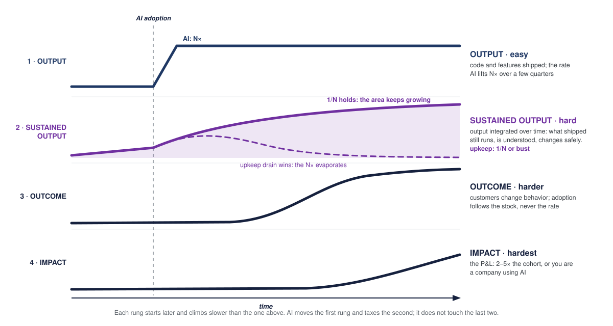
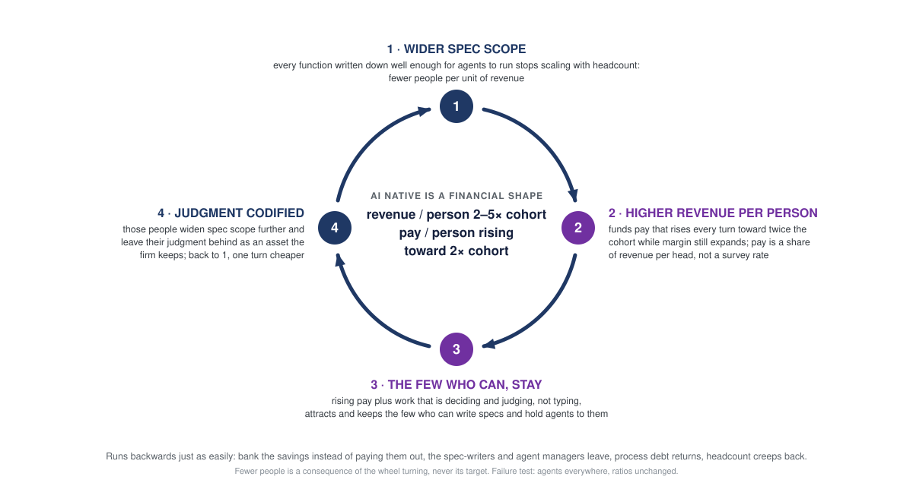

# AI-Native Is a Financial Shape, Not a Tooling Choice

*Ask a leadership team what "becoming an AI company" means and what usually comes back is a purchase order.*

> [!abstract] TL;DR
> AI-native is a financial shape, not a tooling choice. The test is a ratio: revenue per person a multiple of your cohort's at equal or better gross margin (my bar is 2–5×, and it is the shape of that claim I will defend, not the number), with pay per person rising alongside it, so the people inside can tell without reading the annual report. Companies fail that test on a rung the familiar output → outcome → impact ladder does not have. Between output and outcome sits sustained output, the software that still runs and still changes safely, and AI is precisely what taxes it.

## The ladder I have used for years

*The original three rungs. Output counts only once customers use it, and outcome counts only once it moves the organization.*

For years I have used Christophe Achouiantz's output, outcome, impact visual, published on the Crisp blog \[1\]. Output is what you ship: tasks, stories, features, products. Output generates outcome when customers use it: problems solved, new possibilities, changed behavior. Outcome generates impact: the bottom line, the net result for the organization in money and financial ratios.

Apply it to the AI-native, AI-first, AI-whatever debate and the labels stop mattering. There is one test. **You are an AI company if your revenue per person is a multiple of the traditional cohort's in your line of business, at equal or better gross margin.** And if you work at one, you know it without reading the annual report, because your comp is meaningfully above what the same role pays at a traditional company, and the gap widens each year.

## The rung between output and outcome

Those three rungs were drawn before agents, and AI is what makes the missing fourth expensive.

*AI moves the first rung and taxes the second. It does not touch the last two.*
	
**Donella Meadows** separates three things that everyday language blurs in her book Thinking in Systems \[2\]. A *flow* is a rate. A *stock* is what accumulates when the flow runs and the drain does not empty it. A *response to the stock* is behavior that keys off the level rather than off the rate. Her bathtub version: you get wet from the water level, not from how far the tap is open.

**Output is the flow.** Code and features shipped, measured this week. AI makes that rate climb, fast, over a few quarters rather than overnight. Call the multiple N.

**Sustained output is the stock.** The accumulated body of software that still runs, is still understood, and still changes safely. It is output integrated over time, minus the upkeep drain. Titus Winters' line is the compact version: "engineering is programming integrated over time" \[3\]. A stock is the thing a customer can actually rely on, and it is not what a velocity chart measures.

**James Shore** put a condition on that stock \[4\]: an N× boost in output is durable only if upkeep per unit of code falls to 1/N of what it was. Otherwise the drain grows with the pile and eats the gain. His arithmetic is unkind. A 2× output boost with flat per-line maintenance erases itself in nineteen months; if maintenance per line doubles, in five. That is the fork in the ladder figure above. Either 1/N holds and the shaded area keeps growing, or the drain wins and the stock sinks back to roughly where it started, with a larger codebase and the same capability.

Note what that condition does to the usual pitch. "The agent wrote 60% of our code" is a claim about the tap. The question the fork asks is what happened to the drain, and almost nobody instruments it.

**Outcome is the response to the stock.** Customers adopt a product that reliably exists; nobody adopts a shipping velocity. So outcome follows the level, with a lag, and ignores the climb in the rate entirely. On the failure branch it never starts at all.

**Impact is the response to the response.** The P&L, one lag further out, climbing slowest of all.

Adam Bender said the same thing in one sentence: there is "a big difference between generating code 10× faster and engineering 10× faster" \[5\]. AI makes the first rung nearly free and taxes the second. It does not touch the last two.

What an engineering leader does about that second rung, the drain and the two levers on it, is the subject of [Sustained Output Is the Job](sustained-output-is-the-job.md). This essay stays on the top two.

## Why the test has to be relative

The bar moves. When every firm in your cohort rents the same models and coding harnesses, an N× gain in output is competed away within a season. Leigh Van Valen named the mechanism in evolutionary biology \[6\], borrowing Carroll's Red Queen: it takes all the running you can do to keep in the same place. Relative fitness is what survives. Absolute gains are competed away.

So "we ship three times faster than last year" is evidence of nothing. It is table stakes the moment your cohort buys the same subscriptions, and your cohort will, because the capability arrives as a monthly invoice rather than as a decade of institutional learning. The comparison is with the cohort, this year, and with nothing else.

The base rate is sobering. MIT's NANDA report found about 95% of enterprise GenAI pilots with no measurable P&L impact, on 153 responses and not peer reviewed, so treat it as a signal rather than a finding \[7\]. Gartner expects over 40% of agentic AI projects to be canceled by the end of 2027 \[8\]. Output everywhere and impact nowhere is the shape of a company using AI.

## Three horizons, if you sell a software product

The ratio is not produced by one program. It gets built in stages, and the first stage is the one the fork above already described: the core passes only if the upkeep drain falls as the pile grows. McKinsey's three horizons \[9\] map onto the stages cleanly once you drop the assumption that the third horizon is a portfolio of moonshots. The mapping below is my reading, not McKinsey's.

|                       | Revenue is a function of          | Cost is a function of                              | The test                                                                   |
| --------------------- | --------------------------------- | -------------------------------------------------- | -------------------------------------------------------------------------- |
| **H1 · The core**     | customers live                    | headcount                                          | upkeep per unit of code falls as the codebase grows; gross margin and revenue per person improve while the roadmap gets faster |
| **H2 · New products** | bets per year × hit rate          | tokens, leased commodities, a smallish expert team | cost per new product falls every turn                                      |
| **H3 · The firm**     | customers × products per customer | those same three lines, firm-wide                  | revenue per person a multiple of the cohort; pay per person rising with it |

Read the revenue column downward and you are watching revenue decouple from headcount, one step at a time. In the core, more customers means more support, more onboarding, more people. By the third row, revenue is a product of two numbers, neither of which is headcount.

Read the cost column and notice it has three lines, not two.

**Tokens** buy what agents do. That line is real, it is growing, and it is the only one most transformation decks model.

**Leased commodities** buy what the market already sells, for building and for running alike: commodity middleware instead of hand-rolled plumbing, code-health and runtime monitoring instead of home-grown dashboards, telemetry and product analytics instead of guesswork. The test is blunt: if a vendor sells it as a commodity, owning a bespoke copy is a cost line with no ratio behind it.

**A smallish expert team** buys judgment, and it buys attention. Judgment because agents do not have it. Attention because someone has to remain the person who understands the system while many agents change it, and that someone can only ever be a few people. A substantially smaller team sharing one spec also decides faster than a large one that needs translation layers between the people who know and the people who build.

Building bespoke what a vendor sells as a commodity is the same mistake as hiring for what an agent can do, and it lands in the same ratio.

What ties the three lines together is a loop. Every agent run is scored against the spec, and every failure the experts catch becomes a rule the agents are held to next time. That score is what lets tokens replace hours without replacing trust, and it is the mechanism by which judgment stops being a salary and becomes an asset the firm keeps. Without it you are buying volume.

## What each horizon writes down

There is an axis underneath that table, and it is the one I find most useful: each horizon widens what is written down well enough for an agent to run it.

In the core, mostly nothing is. The product exists in the code and in the heads of the people who wrote it, which is exactly why onboarding is slow and why the fifth customer costs almost as much as the first.

At the second horizon, the product is specified, and the spec, not the codebase, becomes the thing new products are built from. That claim carries a condition I argued separately in ["The Spec Is the Product" Is a Slogan Until the Code Leaves Your Repo](the-spec-is-the-product.md).

At the third, two more things get written down. First the way you build: the factory itself, its gates and its rules. Then the way you run: finance first, then operations and compliance. Humans set direction; agents run the process.

That axis is my framing, not the literature's. The horizons work is about growth, not about specification scope, and I have not found anyone who reads it this way. It has been a useful lens, which is a weaker claim than a sourced one.

There is a name for the end state, though. HBS and Microsoft call it a *frontier firm*, "human led, agent operated organizations that put AI at the core of their strategy" \[10\]. Their diagnosis of why most companies stall is worth borrowing: *process debt*, the fragmented and inconsistent workflows that were never written down, so agents have nothing to run. Their prescription is to redesign each process as if the company were built today around agents, and to capture expert judgment as a codified asset.

Take the diagnosis and discount the evidence. Microsoft concedes its survey work shows statistical associations rather than causal effects, it is a vendor selling agents, and between the 2025 and 2026 editions of its own Work Trend Index it quietly dropped the "agent boss" vocabulary and the three-phase model it had proposed the year before \[11\]. The concept earns its place. The percentages do not.

## Finance is the wedge

If you want to know where to start writing the firm down, start where the semantics are already formal. Finance is that place. Double-entry is a spec. A close calendar is a spec. Approval thresholds are a spec. None of that has to be invented, only made executable.

The pieces exist. An event-sourced ledger works as the system of record, which is how Stripe runs money movement: an immutable ledger of events, validated as it goes \[12\]. Agents then execute against that spec under human gates, which is what Anthropic shipped as month-end-close and reconciliation agents, packaged as skills plus approval flows \[13\]. And the oldest prior art here is Amazon's mechanisms: Bezos' "good intentions never work, you need good mechanisms" \[14\], with the caveat that Amazon's mechanisms were always executed by humans and never claimed to be machine-executable.

What a product factory does to a product, this does to the general ledger. Specify it, let agents run it, verify, keep the judgment.

## Where the pattern stops

Sales and marketing do not have formal semantics, and the graveyard of attempts to pretend otherwise is well populated.

Business process reengineering is the big one. Hammer and Champy's own estimate was that 50 to 70 percent of reengineering efforts did not achieve the dramatic results intended \[15\], and the failures clustered exactly where judgment and relationships dominate.

Bridgewater spent more than $100M trying to encode the firm's decision making into software \[16\]. The usual lesson drawn is that management is too subtle to specify. The sharper one is that a spec of a social function is only as honest as the power structure that writes it.

3M ran Six Sigma across the whole company, including research. George Buckley's verdict on that period: "invention is by its very nature a disorderly process" \[17\].

Underneath all three is the same limit. Polanyi's formulation is that we can know more than we can tell \[18\]; Snowden's is that explicit knowledge is tacit knowledge temporarily backgrounded. Some of what your best people know cannot be written down at all, and a spec that pretends otherwise will be confidently wrong in the places that matter most.

For those functions the honest spec is rules plus human gates. Say that out loud before someone says it to you, because the first objection to anything in this essay is going to be the 1990s.

## The two ratios are one loop

*Revenue per person and pay per person are not two goals. They are two readings off the same wheel.*

1. **Wider spec scope, fewer people per unit of revenue.** Every function written down well enough for agents to run it stops scaling with headcount, so the next increment of revenue arrives without the next increment of hiring.
2. **Higher revenue per person funds pay that rises with every turn**, margin still expanding. Pay becomes a share of revenue per head rather than a market rate looked up in a survey.
3. **The few who can do the work stay.** The job is deciding what to build, judging what was built, and running many agents at once, and that is an aptitude, not a seniority level, and scarcer than either. The pay removes the reason to leave; the load is why the team has to stay small.
4. **Those people widen the spec scope further**, and their judgment is codified as the rules and evals the agents are held to. Back to one, a turn cheaper.

That job looks less like programming and more like air-traffic control: many partly finished trajectories in view, intervention only on the exceptions, verification at the rate the agents produce, and one person who still understands the whole system while it changes underneath them. Lisanne Bainbridge described the pattern in 1983 \[19\]: the more a system is automated, the more the remaining human work is supervision and exception handling, which demands more skill, not less. Automation raises and narrows the bar for the humans left.

There is prior art at two very different sizes. Netflix's talent-density rule \[20\]: pay top of market and run lean, because one outstanding person gets more done, and costs less, than two adequate ones. 37signals runs the same rule at small scale, with the top 10% of San Francisco market rates regardless of where you live, no negotiation, equal pay for equal role, and a profit share weighted only by tenure that paid six-figure sums to twenty people for 2024 \[21\]. Revenue per person there is reported above $1M, though by secondary write-ups rather than by the company \[22\]. Kim and Koning, looking at a much younger cohort, find AI-native startups roughly 25% smaller and half a seniority level flatter than their peers, valued the same \[23\]. Few, senior, and paid as if the company were considerably larger, and already observable rather than projected.

## The wheel runs backwards just as easily

Bank the savings instead of paying them out and headcount reduction quietly becomes the goal. The spec-writers and agent managers leave first, because they are the most employable people you have. Process debt returns. Headcount creeps back. You are a company using AI, with a larger codebase and a worse team than you started with.

The ratio invites one wrong reading, so let me close it off. Fewer people per unit of revenue is not a plan to cut people. The denominator falls because the numerator grows without the payroll following it: the same team serving twice the customers and twice the products. The company that ends up smaller is the one you would otherwise have become, the version of you that hired two hundred people to get there. The ratio comes from the headcount you never hire, not from the headcount you have.

## What would change my mind

Pick the bar and write it down before you start, because a bar chosen afterward is a description of whatever happened. Mine is revenue per person at 2–5× the traditional cohort in your line of business, with pay per person rising toward twice what the same role pays there.

That band is a proposed threshold, not a finding, and I would rather say so than dress it up. Five weaknesses, in descending order of how much they bother me:

- **No study establishes either band.** It is my judgment about where a ratio stops being a good year and starts being a different kind of company. What I will defend is the shape, not the number: it has to be a ratio, it has to be against a cohort, and 1.2× is inside the noise.
- **The denominator is usually unavailable.** In most verticals the true peers are private, or consolidated into conglomerates that do not report the segment. You will be estimating the cohort's revenue per employee from two or three public filings that are not quite comparable. That cuts both ways: a claim nobody can falsify is a claim you should be suspicious of, which is the argument for writing your bar down in advance and in public.
- **The numerator can be gamed.** Move engineering to a consultancy and support to an outsourcer and revenue per employee climbs without an agent in sight. The margin condition on the test is there to catch that, and it catches it only partly: an outsourced payroll is still a payroll, but where it lands in the accounts depends on who books it. A CFO will raise this before anyone raises the 1990s.
- **The specification axis is mine**, as noted above.
- **The supporting numbers are soft.** The 95% is a small survey, the 40% is a forecast, and the $1M revenue per person is reported rather than confirmed.

Three numbers for the next board pack, in dependency order:

1. Upkeep per unit of software in production, trending. If this is not falling, nothing below it will move.
2. Cost per new product, per turn. If turn two is not measurably cheaper than turn one, you have a workshop, not a factory.
3. Revenue per person and pay per person, both against the cohort, both trending.

Almost nobody can put those three on a slide today, which is the useful part. Almost none of us work at AI companies yet. A financial shape is something you can measure your way toward. A purchase order is not a shape.

---

\[1\] Christophe Achouiantz, [Output vs Outcome vs Impact](https://blog.crisp.se/2019/10/16/christopheachouiantz/output-vs-outcome-vs-impact), Crisp, 2019, building on Jeff Patton's work.
\[2\] Donella H. Meadows, *Thinking in Systems: A Primer*, Chelsea Green, 2008.
\[3\] Titus Winters, Tom Manshreck, Hyrum Wright, *Software Engineering at Google*, O'Reilly, 2020.
\[4\] James Shore, [You Need AI That Reduces Your Maintenance Costs](https://www.jamesshore.com/v2/blog/2026/you-need-ai-that-reduces-your-maintenance-costs), May 2026.
\[5\] Adam Bender, [Software Engineering at the Tipping Point](https://www.youtube.com/watch?v=2n41YjR5QfU), Google lecture, 2026.
\[6\] Leigh Van Valen, "A New Evolutionary Law", *Evolutionary Theory* 1, 1973.
\[7\] MIT NANDA, *The GenAI Divide: State of AI in Business 2025*, July 2025, [as reported by Forbes](https://www.forbes.com/sites/jasonsnyder/2025/08/26/mit-finds-95-of-genai-pilots-fail-because-companies-avoid-friction/).
\[8\] Gartner, [Over 40% of Agentic AI Projects Will Be Canceled by End of 2027](https://www.gartner.com/en/newsroom/press-releases/2025-06-25-gartner-predicts-over-40-percent-of-agentic-ai-projects-will-be-canceled-by-end-of-2027), 2025-06-25.
\[9\] Mehrdad Baghai, Stephen Coley, David White, *The Alchemy of Growth*, 1999; McKinsey, [Enduring Ideas: The three horizons of growth](https://www.mckinsey.com/capabilities/strategy-and-corporate-finance/our-insights/enduring-ideas-the-three-horizons-of-growth).
\[10\] HBS AI Institute, [Frontier Firm AI Initiative](https://aiinstitute.hbs.edu/d3-and-microsoft-launch-accelerated-ai-research-initiative/); Karim Lakhani, Jared Spataro, Amy Stave, [The "Last Mile" Problem Slowing AI Transformation](https://hbr.org/2026/03/the-last-mile-problem-slowing-ai-transformation), Harvard Business Review, March 2026.
\[11\] Microsoft Work Trend Index, [2025](https://www.microsoft.com/en-us/worklab/work-trend-index/2025-the-year-the-frontier-firm-is-born) and [2026](https://www.microsoft.com/en-us/worklab/work-trend-index/agents-human-agency-and-the-opportunity-for-every-organization).
\[12\] Stripe, [Ledger: Stripe's system for tracking and validating money movement](https://stripe.dev/blog/ledger-stripe-system-for-tracking-and-validating-money-movement).
\[13\] Anthropic, [finance agents](https://www.anthropic.com/news/finance-agents), May 2026.
\[14\] AWS, [Building mechanisms](https://docs.aws.amazon.com/wellarchitected/latest/operational-readiness-reviews/building-mechanisms.html).
\[15\] Michael Hammer and James Champy, *Reengineering the Corporation*, 1993; failure estimate [as discussed in strategy+business](https://www.strategy-business.com/article/19570).
\[16\] [Ray Dalio's Bridgewater is building an algorithmic model of its founder's brain](https://fortune.com/2016/12/24/bridgewater-ray-dalio-algorithm), Fortune, 2016.
\[17\] George Buckley, in [3M's struggle between efficiency and creativity](https://effectuation.org/hubfs/Journal%20Articles/2016/06/3m-struggle-between-efficiency-and-creativity.pdf), BusinessWeek, 2007.
\[18\] Michael Polanyi, *The Tacit Dimension*, 1966; Dave Snowden, [What we cannot say](https://thecynefin.co/what-we-cannot-say/).
\[19\] Lisanne Bainbridge, "Ironies of Automation", *Automatica* 19(6), 1983.
\[20\] Reed Hastings and Erin Meyer, *No Rules Rules*, 2020.
\[21\] 37signals: [How we pay people at Basecamp](https://signalvnoise.com/svn3/how-we-pay-people-at-basecamp/), [Making a Career](https://basecamp.com/handbook/making-a-career), [Pay people, not addresses](https://37signals.com/19); profit share per [DHH](https://x.com/dhh/status/1888162121474605110).
\[22\] Revenue per person as reported by [secondary sources](https://softwaresidehustler.substack.com/p/37signals-remarkable-profitability), not confirmed by the company.
\[23\] Jin Hyung Kim and Rembrand Koning, [AI-Native Firms](https://www.hbs.edu/ris/Publication%20Files/26-090_96f92aa0-37d9-4789-beaa-5c0cb87a4032.pdf), HBS Working Paper 26-090, June 2026.
