# Martin Rosén-Lidholm

+45 31 76 37 01 | martin@rosenlidholm.se | [linkedin.com/in/martin-rosen-lidholm](https://www.linkedin.com/in/martin-rosen-lidholm/) | Malmö/Copenhagen

**VP Product & Engineering | Scaling AI-native SaaS in regulated, document-heavy domains | Agentic engineering + product operating models**

> "I'm glad to see this map, the experience… I got that view after a few of my experiments in that direction."
> — Alistair Cockburn, Agile Manifesto co-author, [reposting my Wardley-mapped agentic engineering strategy](https://www.linkedin.com/feed/update/urn:li:activity:7492155597677744128/)

*The map Alistair Cockburn reposted.*

## About

Product and Engineering leader who scales SaaS platforms in regulated, document-heavy domains. Currently VP of Product & Engineering at ChronosHub (an ACS company; IEEE is the largest customer), rebuilding a 30-person product and engineering organization around agentic engineering and AI-native products, for humans and agents alike. I install product operating models, raise delivery velocity, and make engineering organizations AI-native without losing governance. Underneath the org design I am a systems thinker: I map company and product strategy down to architecture and implementation using Wardley Mapping, Rumelt's kernel and tests, and event modeling. That spans both zero-to-one and one-to-n: finding what earns through fast build-measure-learn discovery, then keeping it earning as durable, operated product. I never hesitate to roll up my sleeves, be it code, automation, or workshops, where the most impact is produced. Selected cases evidencing these claims: [martinrl.github.io/cases](https://martinrl.github.io/cases).

## Selected impact

- Rebuilding ChronosHub's 30-person Product & Engineering organization from the ground up around agentic engineering and AI-native products; executive sponsor of FrontierHub, the company-wide AI frontier-firm transformation. Six months in, the ChronosHub Factory produces code 100% agentically, compiled from event-model and experience-model specs, every line passing an independent, spec-derived verification gate at a code health above the published agentic-AI threshold (CodeHealth 9.4+ of 10); a two-week release cadence holds, defect share is down from 63% to 25%, and incident detection dropped from weeks to minutes.
- Led the transformation of team-as-a-service and custom solutions to agentic engineering at Context& as Fellow, the highest-ranking title and most senior technical leader, with HR responsibility for ~25 engineers: rethinking strategy and business models, up- and reskilling people, and adopting LLM-based technology first for software development, then for the products being built.
- Reduced cycle times across ~80 engineers in five European locations at Templafy by coaching Engineering Managers in lean/kanban flow efficiency.
- Designed and drove a career ladder at a 60-engineer SaaS scale-up: two Staff promotions and two senior EM promotions within three months of launch.
- Co-designed a Wardley-mapped "minimum viable telco" model showing ~90% operational cost reduction; contributed to Telenor DK's BSS landscape and application strategy.
- Defined and validated a new event-driven and event-sourced architecture for Portchain's core real-time vessel ETA product as VP of Engineering and management team member.
- Drove the project-to-product transformation at Keylane Advice as the technology executive on the management team: restructured ~30 developers into outcome-accountable product teams with a CEO-led Flow Office, during consecutive gazelle-growth years.

## Experience

### ChronosHub — VP of Product & Engineering
*February 2026 - present, Copenhagen*

Scholarly publishing SaaS owned by the American Chemical Society; largest customer IEEE. Rebuilding the 30-person Product & Engineering organization (Engineers, Product Managers, Designers; full HR responsibility) from the ground up with laser focus on agentic engineering and AI-native products for humans and agents alike, grounded in my D4 strategy lens: D1 Agentic Engineering (how we build), D2 AI in the Product (what we build), D3 Build for Agents (who consumes), D4 Performance & Cost (how we sustain). Executive sponsor of FrontierHub, the initiative moving the whole company to an AI frontier firm. A daily brief, analyzed through the D4 and my Software Civil Engineering lenses, is published at [martinrl.github.io/chronograph](https://martinrl.github.io/chronograph).

### Delegate — Fellow
*January 2025 - January 2026, Greater Copenhagen*

First Fellow (highest level of the career ladder), combining technical leadership and people management of almost 30 .NET consultants. Helped evolve the business model toward team-as-a-service for mature customers, per the DevOps philosophy "we build it, we run it": teams and capabilities rather than individuals and hours.

### HBK — Software Architect
*October 2024 - December 2024, Greater Copenhagen*

Mapped architecture to product strategy for BK Connect, the market-leading sound and vibration analysis platform (~11M LOC, ~€22M ARR). After a major reorg, designed and led an innovation initiative around post-processing, seeking product/market fit for deeper insights from recorded sound and vibration data.

### Portchain — VP of Engineering
*March 2024 - August 2024, Copenhagen*

Responsible for Engineering at a fast-paced shipping SaaS startup. Ran a deep technical and workflow review (CodeScene, CodeClimate, Jira/MergeStat metrics), then defined a new team setup, architecture, and tech stack for the core product Connect: an event-driven .NET architecture with Marten/PostgreSQL, heavy parallel data ingestion via TPL Dataflow, and a real-time vessel ETA dashboard on Blazor Server. Management team member: board and investor presentations, stakeholder management, and all major Engineering operations.

### Templafy — Director of Engineering
*February 2022 - February 2024, Copenhagen*

Led Engineering Managers and Staff Engineers covering a substantial part of an ~80-engineer organization across five European locations, structured by Team Topologies on a self-contained systems architecture. Reported to the CTO; acting CTO during a period of uncertainty. Drove the shift to empowered product teams with fast discovery loops in tight collaboration with Product. Biggest personal impact: increased team flow efficiency and reduced cycle times by coaching Engineering Managers in lean and kanban principles, and brought strategy-to-operation visibility through flight levels, cost of delay, and a digital Obeya.

### CBB (Telenor) — Chief Software Architect
*April 2018 - January 2022, Copenhagen*

Moved sideways to a technology focus as part of the MVNO/CBB merger. Rearchitected the on-prem microservice landscape to an event-first architecture (event modeling, DDD, CQRS, event sourcing) for cloud-native future-proofing, service independence, and rapidly increasing security, regulatory, and compliance demands; every POC and POT passed before the transition was set in motion. In parallel: acting department head, member of the task force defining Telenor DK's business support system landscape and application strategy, and co-founder of an internal no-frills telco startup concept.

### Telenor — Head of Development, MVNO
*February 2017 - March 2018, Copenhagen*

Managed and led ~10 developers, testers, and DevOps/cloud engineers building a market-leading multi-tenant BSS for mobile virtual network operators. Architecture, code reviews, forecasting, hiring, and continuous delivery-process optimization.

### Keylane — Chief Development Manager, Advice
*January 2016 - January 2017, Copenhagen*

Executive team member responsible for transforming development and delivery from project to product, and the architecture of the product portfolio, during consecutive "gazelle" growth years. Managed ~30 software developers through people and technology leaders. High trade-off complexity: half the revenue from time and materials, half from recurring licenses.

### Telenor — Lead Developer → Head of Development, MVNO
*December 2011 - January 2016, Copenhagen*

Transitioned from hands-on coding to force multiplier to managing the work, leading the people, and setting the target architecture for increasing demands, through the MVNO's integration into Telenor and onboarding of external customers.

### Miscellaneous — Developer/Architect/Team Lead
*June 1998 - November 2011, Lund/Malmö/Copenhagen*

From Tetra Pak R&D (where I wrote my master's thesis) through a hyper-growing startup and most things in between, across domains, always with a strong architecture (DDD), Microsoft, and .NET focus.

## Community

- **Øredev**, Program Committee Member, 2014 - current, Malmö. Lead the leadership track and contribute to the architecture and .NET tracks of the region's leading software development conference (1,300 attendees yearly).
- **Global Agile Summit**, Tallinn, Program Committee Member, curating the Developer track.
- Long-time active member: Copenhagen and Skåne .NET user groups, AgilityLab Copenhagen, Domain-Driven Design Copenhagen (e.g. expert panel member).
- Active voice in the industry: short and punchy on [LinkedIn](https://www.linkedin.com/in/martin-rosen-lidholm/), longer form at [Chronograph](https://martinrl.github.io/chronograph). Alex Bunardzic: ["This is the second time I've heard a fresh, breakthrough idea from Martin."](https://www.linkedin.com/feed/update/urn:li:activity:7485706695508156416/)

## Education

- **Lund University (LTH, Faculty of Engineering)**, M.Sc., 1993 - 1998, Lund
- **Swedish Army (conscription)**, Corporal, 1992 - 1993, Eksjö

## Languages

Swedish (native) | English (full professional) | Danish (full professional; working language 18 years)

## Recommendations (snippets from LinkedIn)

- **René Gundersen**, Director of Engineering: "Martin has vast knowledge and experience around how to create an efficient delivery organisation... his ability to use the knowledge he has to see situations from untraditional perspectives, unlocking solutions which weren't in plain sight."
- **Ibrahim Hammad**, Senior Engineering Manager: "He's a true leader. His ability to uplift everyone around him is remarkable... He was pivotal in scaling the company up, and preparing us for future challenges."
- **Dannie Walden**, Lead Software Engineer: "Domain-Driven Design, Sociotechnical Systems, Team Topologies, Wardley Mapping - you name it, Martin knows about it - and yes, he UNDERSTANDS it as well."

## Interests

Music has always been a big part of my life; I often attend concerts and festivals with my wife and lifelong friends. As an adult I have become an avid ultra-distance cyclist. A few notable results have come from hard training and meticulous planning, but the true reward is the adventure, friendships, and experiences far beyond the results.
