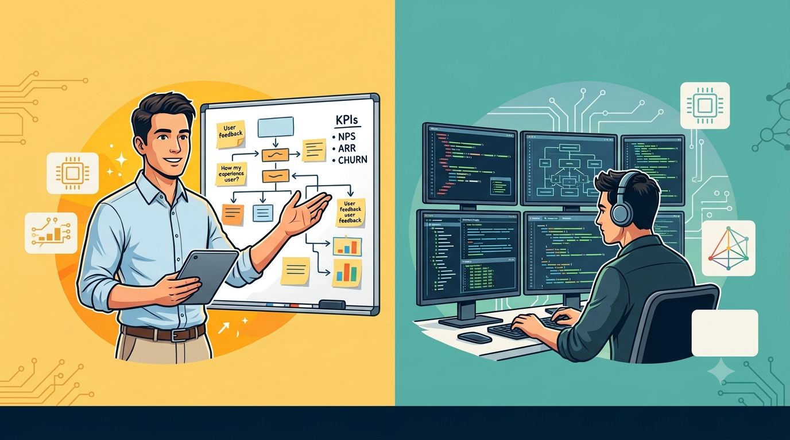

# In Defence of the Software Engineer Lacking People Skills

## Consulting Polish Is No Longer a Gate on Magnitude-Level Impact

---

---

Read any hiring thread, career ladder, or VC newsletter right now and you will meet the same person: the engineer who manages a fleet of coding agents, thinks like a product manager, sells like an account executive, and presents like a management consultant. We call them product engineers. We call them forward deployed engineers. a16z called the FDE "the hottest job in startups right now." Palantir's job ads want "a personable communicator who can explain technical concepts clearly and credibly to executive stakeholders." OpenAI's FDE interview loop reportedly weights client-facing communication equal to technical depth.

I am part of this chorus. I have written strategy documents that lean on the FDE model, on product-minded engineering, on discovery. I believe in all of it.

And yet we are collectively forgetting someone: the deeply skilled engineer who is none of those things in a meeting room, and who might be the highest-leverage hire you can make right now.

## The consensus, steelmanned

The case for the full-package engineer is not stupid, so let me state it properly.

Coding is getting cheap and fast, so the scarce input moves upstream: knowing what to build, extracting what customers actually need, exercising taste. That work is done with people, in rooms. DORA's State of AI-assisted Software Development report backs a version of this: without user-centric focus, AI adoption actually hurts team performance. You just build the wrong thing faster.

Meanwhile the traditional tech org has long required people skills for staff+ roles for a good reason. Past senior level, your impact must exceed what you can personally ship, and the canonical mechanism is other people: mentoring, coaching, glue work, influence. A staff engineer who multiplies a team of eight is worth more than one who is merely excellent alone.

Both arguments are correct. Neither is complete.

## The force multiplier we forgot

Here is the arithmetic nobody in the discourse writes down.

Coaching and mentoring multiply a team. Done superbly, a staff engineer lifts eight or ten colleagues by some meaningful factor. Call it one order of magnitude of reach, on a good day, compounding slowly.

Factory work multiplies every run of the factory. The engineer who codifies your engineering rigor into an agent harness (the verification contracts, the guardrails, the evals, the code-health gates, the encoded domain rules) is not lifting eight colleagues. They are lifting every agent-run, every day, for every engineer and every agent that works inside that system, indefinitely. That is not one order of magnitude. That is several.

This is not speculation anymore. In February, OpenAI described an internal product of roughly a million lines of production code, around 1,500 merged pull requests, built in five months by a small team of three engineers driving Codex, with zero manually written lines. Their estimate: a tenth of the time hand-writing would have taken. The engineers' job was designing the environment in which agents could work reliably. Datadog, building infrastructure the same way, put it plainly: "AI agents can now produce software faster than any team can verify it. The bottleneck has moved from writing code to trusting what was written." Their humans' role was "narrow but consequential: define the system idea and invariants, review and strengthen the harness, set measurable targets, and approve architectural changes." At Coinbase, an internal coding-agent platform reportedly started by two engineers now serves more than a thousand, with PR cycle times down from around 150 hours to 15.

Two engineers multiplying a thousand colleagues. Read the job description inside those accounts carefully. Define invariants. Strengthen the verification harness. Set measurable targets. There is no whiteboard workshop in it, no executive presentation, no customer dinner. It is deep, rigorous, mostly solitary codification work. It is also, and this is the point, the single highest-leverage engineering work described anywhere in the 2025-2026 literature. The DORA data agrees at the organizational level: platform quality determines whether AI adoption helps your company at all. The factory-builder gates everyone else's AI returns.

We have seen this profile before. The civil engineers who designed the factories, bridges, and production lines of the industrial world multiplied the output of thousands of workers without managing a single one of them. Christopher Meiklejohn, arriving at the same analogy this spring, wrote that the structural engineer's job "isn't to weld. It's to create a system where welding happens safely within well-defined constraints." The profession is splitting along exactly this line, and our hiring discourse has only written the job spec for one side of the split.

## The people skill that actually matters now

So can the factory-builder skip communication altogether? No, and it is important to be precise about why, because the precision is where the hiring insight lives.

The factory is in (crucial) part made of writing. The load-bearing materials of an agent harness are specifications, AGENTS.md and CLAUDE.md files, evals, invariants, architecture decision records. These are authored, natural-language artifacts, and their quality directly sets the ceiling on what the agents can do. Sean Grove of OpenAI overstated it only slightly: "in the near future, the person who communicates most effectively is the most valuable programmer." An engineer who cannot produce a precise written artifact cannot build the factory, because one critical pillar of the factory is precise written artifacts. (And I've witnessed many skilled artisans not able to scale their craft to factory levels because a lack of precisely this.)

Communication, in other words, has not become less important in the agentic era. It has changed medium, from live performance to durable artifact. And it has changed audience, from humans to agents and the humans who audit them. Mentoring becomes encoding: the senior engineer's judgment goes into the harness rules and the eval suite instead of into a weekly 1:1, where it multiplies further and never leaves when they do. Persuasion becomes evidence: the harness produces reproducible verification results that argue on the engineer's behalf. Review becomes a verification contract instead of a negotiation.

The consequence cuts both ways. Written communication skills are now more important than they have ever been; they are the difference between an engineer who gets personal gains from agentic coding and one who multiplies a whole organization. But the interpersonal layer, the facilitation, the presenting, the consulting polish, is no longer a gate on that multiplication. The introvert who writes with precision was never lacking communication skills. Our interview loops were just measuring the wrong channel.

## The unbundling

Here is what I think we get wrong. "People skills" is not one thing. The phrase bundles at least three separable abilities: live facilitation and presentation (the consulting polish), precise artifact communication (writing things that survive contact with reality), and judgment about what matters. The traditional org needed them fused in one person because human coordination was the only transmission mechanism for engineering judgment. Agentic engineering unbundles them. Judgment now transmits through the harness. Writing carries more of the load than talking. Only the live-performance layer remains genuinely interpersonal, and that layer can be supplied by someone else.

Which brings us to the economics. The full-package engineer exists, and I have been lucky to work with, lead, and manage a few. But the market data on the current hunt for them is brutal: forward deployed engineer postings grew 1,165% year over year, frontier labs reportedly pay staff FDEs $600K to $1.2M, and recruiters describe "a candidate pool that barely existed two years ago." One recruiting analysis called the profile "a personality type as much as a skill set," which the industry has not been cultivating. These people are unicorns, priced like unicorns, and there are not enough of them for your company and everyone else's.

The rational response is not to keep bidding. It is to decompose. Some AI-native companies already do this, organizing FDEs into pods that pair technical execution with a deployment strategist who handles account-level coordination. The same move works internally: pair the deep codifier with a product manager or engineering leader who fronts the stakeholders, and let each do what they are exceptional at. The second-best profile, the brilliant solver without the polish, multiplied by a factory, will outproduce the unicorn you cannot hire.

## The conditions, because this is not a fairy tale

Two failure modes are documented well enough that ignoring them would be malpractice.

Factories die without adoption work. The platform engineering literature is a graveyard of technically excellent internal platforms nobody used; the State of Platform Engineering report found 40.9% of platform initiatives cannot demonstrate measurable value within their first year, and case studies of adoption collapsing within a quarter are easy to find. Somebody has to do the evangelism, the onboarding, the listening. If it will not be your factory-builder, it must explicitly be someone else. That is a staffing decision, not an afterthought.

And the lone codifier is a bus-factor bet. If the domain rules encoded in the harness are wrong, the factory mass-produces the error. Verification burden is already the emerging constraint: telemetry shows AI-heavy teams merging far more PRs while review time and defect rates climb. The answer is the same discipline civil engineering landed on: the specification is reviewed, the invariants are owned by more than one head, and trust is placed in the verification system rather than in any individual's self-assessment.

## What I am actually asking

Not that we stop valuing product sense, customer empathy, or the ability to hold a room. Those remain real and valuable, and the engineers who have everything remain the best hires.

I am asking hiring managers and ladder-writers to do three things. Stop treating consulting-grade people skills as a gate for magnitude-level impact, because the evidence now says the biggest multipliers of 2025 and 2026 came from harness work, not workshops. Start measuring artifact communication (specs, evals, encoded judgment) as a first-class skill instead of a consolation prize, because it is the medium the factory runs on and it matters more now than it ever has. And when you meet the brilliant, awkward, quiet engineer who would rather codify your domain into a verification harness than present it to your board: do not pass. Pair them. The civil engineers who built the factories did not run the sales meetings either. The factories got built all the same, and they are what multiplied everything else.

---

*Sources referenced: OpenAI, "Harness engineering" (Feb 2026); Datadog, "Harness-first agents" series (2026); Lenny's Newsletter on Coinbase Forge; DORA 2025; Meiklejohn, "Software Engineering Is Becoming Civil Engineering" (Apr 2026); Grove, "The New Code" (AI Engineer World's Fair 2025); Bloomberry FDE posting analysis (2026); Paraform FDE hiring reports (2026); State of Platform Engineering Vol. 4 (2025); Faros AI engineering telemetry (2025-2026); a16z, "Services-led growth" (2025); Larson, StaffEng archetypes.*
