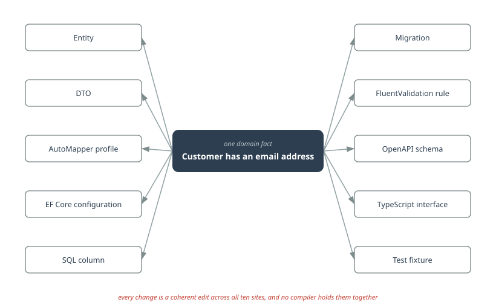
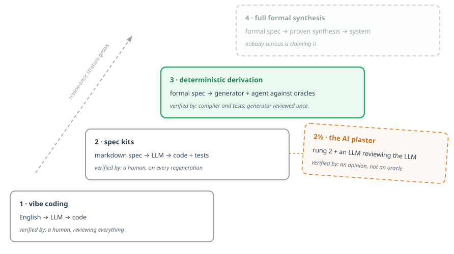
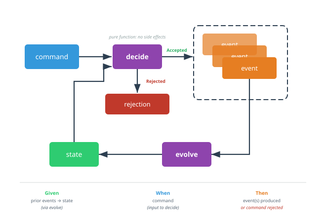

# "The Spec Is the Product" Is a Slogan Until the Code Leaves Your Repo

> Everyone agrees verification is the bottleneck. Almost nobody draws the conclusion
> sitting in their `.gitignore`.

## The bottleneck everyone agrees on

Here is the one thing the whole industry currently agrees on: with LLM agents, producing code is no longer the expensive part. *Knowing it is right* is. Verification is the bottleneck. Every serious writer on agentic engineering has landed there — the debates are about what to do about it.

The popular answer is "programming in English": vibe coding, spec kits, spec-first IDEs. Capture intent in a markdown spec, let the agent transform it into code, keep the spec as the durable artifact. And that answer is right about exactly half of it. Intent, not code, *should* be the durable artifact.

But look at who performs the transformation in every one of those setups: **an LLM**. Markdown in, probabilistic code out. Every regeneration is a fresh stochastic outcome; diffs don't compose; every run is a new review event. You declared "the spec is the product" — and then wired the world's least deterministic compiler between the product and the thing that ships. The verification bottleneck you set out to relieve is now *load-bearing* on every regeneration.

There is a harder conclusion hiding under the consensus, and this article is about drawing it. It ends with C# files that are not source code, and a `git rm` that made a build *more* trustworthy.

## The enemy has a name

Start with a question you can answer about your own codebase right now: how many places know that a customer has an email address?

The entity. The DTO. The AutoMapper profile. The EF Core configuration. The SQL column. The migration that created the column. The FluentValidation rule. The OpenAPI schema. The TypeScript interface. The test fixture. Ten representations of **one** domain fact — and every behavioral change is a coherent edit across ten sites at once.



*One domain fact, ten restatements. No compiler error fires when any two of them disagree.*

This deserves its own name: **representational redundancy**. Not "layers", not "boilerplate" — *restatement*. The same truth transcribed between representations that no compiler holds together.

Humans have always drifted on this — it is why "the documentation lies" became folklore. But notice exactly what LLM agents are *worst* at: coherent editing across many sites. An agent produces plausible code at every individual site; it is *between* the sites that things break, and between the sites is precisely where no oracle lives. No compiler error fires when the validator disagrees with the DTO. No test fails when the OpenAPI schema drifts from the entity — until an integration test, minutes and containers away, maybe.

So representational redundancy is not merely expensive the way it always was. It is expensive precisely where the new workforce is weakest, and cheap verification is precisely what the new workforce needs most. Every restatement you delete is a class of agent error that can no longer occur.

Deterministic derivation does not *manage* that redundancy. It **deletes** it.

## Who transforms, what verifies

There is a ladder, and the rungs differ in exactly two properties: *who performs the transformation from intent to code, and what verifies the result*.

1. English → LLM → code, a human reviews everything. (Vibe coding — even the man who
   coined it scoped it to throwaway projects.)
2. Markdown spec → LLM → code + tests. Intent captured; transformation still stochastic;
   every regeneration still a review event.
   - **Rung 2½, the AI plaster:** markdown spec → LLM → code, and a second LLM reviews
     the output. The industry's actual current answer, and a half-rung, not a rung; the
     next section explains why it cannot hold weight.
3. **Formal spec → deterministic generator for the provable stratum + an agent writing
   the rest against compiler and test oracles.**
4. Full formal synthesis. (Nobody serious is claiming it.)



*The ladder. Every rung answers the same two questions: who transforms, what verifies. Rung 3 is where regeneration stops being a review event. Rung 2½ hangs off the side, because half-rungs hold no weight.*

Every rung up buys *review-once* semantics for a larger stratum. On rung 2 you review the generated code every time, because you must — the transformer is a distribution, not a function. On rung 3 you review the generator once, prove it against the spec, and from then on regeneration is a build step. Same spec in, byte-identical code out. CI can assert `artifact == f(spec, generator)` as an invariant, not as a hope.

## Rung 2½: the AI plaster

Rung 2½ deserves its own section, because it is where most of the industry's effort is actually going. Nobody serious still claims a human can review every regeneration; the proposed fix is to make the reviewer an LLM too. Self-correction loops. Generator–critic pairs. Multi-agent debate. An entire product category of AI code reviewers, now routinely reviewing agent-written pull requests: AI reviewing AI. If the review event is the bottleneck, automate the review event.

The research on this is unusually unanimous, and it is not kind. LLMs [cannot self-correct their own reasoning](https://proceedings.iclr.cc/paper_files/paper/2024/file/8b4add8b0aa8749d80a34ca5d941c355-Paper-Conference.pdf) without an external signal; when the checker is the generator, verification accuracy collapses toward generation accuracy. Adding more models does not add independence: critics that share training data and architecture with the generator share its blind spots, debate performs about as well as sampling the same model repeatedly, and [judges measurably favor their own generations](https://arxiv.org/html/2508.02994v1). And on exactly the task rung 2 needs performed, judging whether code matches a natural-language spec, LLMs [fail systematically](https://arxiv.org/abs/2508.12358): they misclassify correct code, they hallucinate defects, and the effect gets *worse* as review prompts get more detailed, a failure mode with its own name in the literature, [systematic overcorrection](https://arxiv.org/abs/2603.00539). Production numbers agree with the lab: a [three-week parallel trial of four commercial AI reviewers](https://dev.to/_vjk/best-ai-code-reviewer-in-2026-we-ran-4-in-parallel-for-3-weeks-146-prs-679-findings-1c0f) found catch rates ranging from 44% to 82% depending on the tool, with false-positive rates that make every finding itself a small review event.

None of this means the tools are useless; as amplifiers of human review they clearly pay rent. It means they cannot change the rung. A stochastic judge of a stochastic transformer is still a distribution, not a function. Stack as many correlated judges as you like: you lower the *variance* of the review event, you never delete it. `artifact == f(spec, generator)` is not a statement any ensemble of opinions can make. That is why 2½ is a half-rung. It changes *who reviews*, which improves the economics, without changing *what verifies*, which sets the semantics. The plaster makes the illness cheaper to live with; the illness is that between the representations no oracle lives, and another opinion is not an oracle. The ladder is climbed on a different axis entirely: the verifier's *determinism*, not the verifier's species. Replace the human reviewer with an agent and you are standing exactly where you were. Replace opinion with oracle and you are on rung 3.

Dijkstra said it in 1978, about the idea of programming in natural language: formal texts are effective precisely because their legitimacy can be checked by a few simple rules — while natural language excels at making nonsense non-obvious. Forty-eight years later, that is the entire difference between rung 2, however thickly plastered, and rung 3.

But rung 3 has a trap door, and everyone who has been in .NET long enough has fallen through it.

## Three acts of generated code in .NET

**Act one, 2002.** Windows Forms v1 generated `InitializeComponent` straight into *your* file, fenced off with a comment: `#region Windows Form Designer generated code` and a stern "do not modify the contents of this method". Everyone modified the contents of this method. The designer overwrote their edits, or worse, half-parsed them back. And the frontend was the small stage. The same year, on the backend, `XSD.exe` spat out typed DataSets, thousands of lines of generated C# per schema under the same do-not-edit header, and the first wave of DAL generators went industrial: the original LLBLGen, CodeSmith running its templates against the database at build-your-own-architecture scale. Entire data-access layers, generated straight into the project, edited by hand the moment the generator's output was 95% right, flattened at the next regeneration. The boundary between generated and human code was a *comment* — that is, a promise.

**Act two, 2005.** .NET 2.0 shipped partial classes, and the generated half moved into `Form1.Designer.cs`. The DAL world industrialized the same move. LLBLGen Pro regenerated its designer-driven entities around [*user code regions*](https://www.llblgen.com/Documentation/5.6/LLBLGen%20Pro%20RTF/Using%20the%20generated%20code/gencode_addingusercode.htm), marked blocks where your hand-written code was supposed to survive regeneration. CodeSmith's .netTiers templates split output into generated and custom halves; SubSonic leaned on partial classes. Entity Framework did the same dance with EDMX and T4: `Model.Designer.cs`, thousands of lines of generated C#, sitting in your repo, in your diffs, in your merge conflicts. The boundary was now a *file* — better. But the file was still version controlled, so it was still editable, still reviewable, still mergeable, and under deadline pressure somebody always did edit it, because the model was regenerated "later" and later never came. MDA-era tooling made the grandest version of the promise — "protected regions", the pattern's proper name — and the regions rotted quietly, everywhere, and took the whole Model-Driven Architecture movement down with them. The .NET epilogue says it plainest: LLBLGen's own vendor eventually deprecated user code regions and removed their documentation, advising customers to migrate their code out. The mechanism's inventors stopped believing the promise.

Both acts share one root cause: **the generated code was in the repository.** Anything in the repo is, by the social contract of version control, source — reviewable, editable, ownable. No comment fence and no file split can override that contract. As long as the code is in git, "the model is the product" is a slogan, because the repo says otherwise every time someone opens a diff.

**Act three is a Roslyn source generator.** The generator runs *inside the compiler*. Its output exists only in the compilation — never on disk as a file you can open, edit, or commit. Hand-editing the generated code is not forbidden by a comment or discouraged by a file name; it is impossible *by construction*, the way editing the compiler's register allocation is impossible. And the escape valve is typed: a `partial` method seam, where *missing* human code is a compile error — not a protected region quietly rotting.

This is the piece the "programming in English" conversation keeps missing, and it is C#'s quiet, categorical advantage. Every stack has code generation — protobuf, OpenAPI generators, Prisma — and nearly all of them emit files that end up committed, which puts them permanently in act two. The principle is stack-agnostic; the *mechanism* is not. A source generator makes "never versioned" a property of the toolchain instead of a `.gitignore` discipline.

## The repo boundary is a decision boundary

Nobody commits `.o` files. Nobody commits `node_modules`, or compiled CSS, or the IL that `csc` emits. Not because those artifacts are worthless — the shipped product is literally made of them — but because they are *derivable*: a pure function of things already in the repo. Versioning them would record no decision. Version control is for decisions.

Now apply that rule with a straight face: a C# record layer that is a pure, deterministic function of a spec **is a build artifact**. The `.cs` extension does not make it source. *Source* is defined by causality — is this file where the decision lives? — not by file type. If every byte of `Commands.cs` is determined by `spec.yaml` plus a generator, then `Commands.cs` in git is a cached intermediate, checked in. We have a word for committed caches that can drift from their inputs: bugs waiting.

Deleting those files from git is therefore not housekeeping. It is a forcing function — the mechanism that turns the slogan structural:

- **The spec becomes the only change surface.** You cannot patch the generated code under
  deadline, because there is no file to patch. The act-two failure mode is not
  discouraged; it is gone.
- **Review collapses to two objects.** The spec (small, declarative, diffable) and the
  generator (reviewed once, proven, then frozen into a build step). Regeneration stops
  being a review event.
- **Drift becomes unrepresentable.** The generated representation cannot disagree with
  the spec, because it has no independent existence. There is nothing left to drift
  *from*.

That is what deleting representational redundancy actually means. Not DRY as a style preference — the *removal of an entire category of state* in which the system could be wrong.

## The training-data objection, inverted

The reflexive objection: LLMs are most fluent where training data is thickest — mainstream layered CRUD — so a project-local spec dialect starves the agent exactly where this architecture needs it to read and write specs.

The objection assumes the spec's *semantics* are as exotic as its file extension. They are not. An event model spec for an event-sourced core is made of commands, events, business errors, and Given–When–Then scenarios — which is to say: VSA, CQRS, and BDD, heavily represented software concepts in any training corpus. An event model is a thin arrangement notation over primitives every agent already knows cold. The surface syntax is local; the semantics are high-resource.

And the payoff side of the trade is lopsided. What the agent gets in exchange for learning a small dialect is an environment where its characteristic failure mode has been deleted: a new event in the spec becomes a compile error at every site that must handle it — exhaustive switches, no default arms, warnings as errors. Pure Given–When–Then tests over total functions run in seconds, no mocks, no containers. The agent is an amplifier of whatever verification regime already exists; amplified diffuse verification yields plausible drift at machine speed, amplified concentrated verification yields checkable increments at machine speed. Trading a sliver of syntactic fluency for an order-of-magnitude denser oracle field is not a weakness to mitigate. It is the whole point.

One honest line, though: nobody has published the benchmark. This is an argument, not a measurement.

## The mechanism, in one slice

Concretely, the spec dialect here is [emlang](https://github.com/emlang-project/emlang): a small YAML DSL for [Event Modeling](https://eventmodeling.org/). A model is a list of vertical slices on a timeline (i.e., storytelling, the oldest way of conveying information in the history of mankind); a slice is not a free-form sequence; every slice instantiates one of Event Modeling's four patterns: state change (a command decides events, or a business error), state view (events fold into a view), automation (a view feeds a processor that issues commands), and translation (foreign events become native ones). emlang spells the participants `c:` (command), `e:` (event), `x:` (business error), `v:` (view), and `t:` (trigger). It is not the only textual dialect; the notation is growing several, most notably [Martin Dilger's Event Modeling JSON Schema](https://github.com/dilgerma/event-modeling-spec), the machine-readable contract behind his [Event Modelers platform](https://www.eventmodelers.ai/) and his book [*Understanding Eventsourcing*](https://github.com/dilgerma/eventsourcing-book). The argument in this article is indifferent to which dialect you pick; it only requires that the spec is formal and the transformation is a function.

One thing must be said plainly, because it is the load-bearing detail: a slice is not only structure, it is *specified*. A state-change slice carries Given–When–Then scenarios: given this decision state, when this command, then these events, or this business error. A state-view slice carries Given–Then scenarios: given these events, the view must read thus (no *when*, because a projection decides nothing; it only accumulates). This is not an emlang embellishment; slice-level scenarios are Event Modeling's own completion criterion.

Here are two slices from a scholarly-publishing domain, scenarios included: first the state-view slice that folds events into the decision model the decider reads, then the state-change slice that decides on it.

```yaml
slices:
  Journal decision model:
    steps:
      - v: State / Journal   # the decider's decision model: what decide reads
        props: { journalId: Guid, windowOpen: bool, submitted: Guid[] }
    tests:
      Opened then closed folds to a closed window:
        given:
          - e: Submission window opened   # events owned by other slices
          - e: Submission window closed
        then:
          - v: State / Journal
            props: { windowOpen: false }

  Submit manuscript:
    steps:
      - c: Author / Submit manuscript
        props: { manuscriptId: Guid, journalId: Guid, title: string }
      - e: Manuscript / Manuscript submitted
        props: { manuscriptId: Guid, journalId: Guid, title: string, submittedAt: DateTimeOffset }
      - x: Submissions closed
    tests:
      Submitting into an open window is accepted:
        given:
          - v: State / Journal
            props: { windowOpen: true }
        when:
          - c: Submit manuscript
            props: { title: Attention Is All You Need }
        then:
          - e: Manuscript submitted
            props: { title: Attention Is All You Need }
      Submitting after the window closes is rejected:
        given:
          - v: State / Journal
            props: { windowOpen: false }
        when:
          - c: Submit manuscript
        then:
          - x: Submissions closed
```

The Roslyn source generator reads that YAML as an `AdditionalFile` inside the compiler and emits the record layer; the essential shape is a few lines:

```csharp
[Generator]
public sealed class VocabularyGenerator : IIncrementalGenerator
{
    public void Initialize(IncrementalGeneratorInitializationContext context)
    {
        var models = context.AdditionalTextsProvider
            .Where(f => f.Path.EndsWith(".emlang.yaml"))
            .Select((f, ct) => EmlangParser.Parse(f.GetText(ct)!.ToString()));

        context.RegisterSourceOutput(models, static (ctx, model) =>
        {
            var sb = new StringBuilder("namespace Journal.Submissions;\n\n");
            sb.AppendLine($"public abstract record {model.Name}Command;");
            sb.AppendLine($"public abstract record {model.Name}Event;");
            sb.AppendLine($"public abstract record {model.Name}Error;");
            foreach (var c in model.Commands)   // "Submit manuscript" → SubmitManuscript
                sb.AppendLine($"public sealed record {c.PascalName}({c.ParameterList}) : {model.Name}Command;");
            foreach (var e in model.Events)
                sb.AppendLine($"public sealed record {e.PascalName}({e.ParameterList}) : {model.Name}Event;");
            foreach (var x in model.Errors)
                sb.AppendLine($"public sealed record {x.PascalName}() : {model.Name}Error;");
            ctx.AddSource("Vocabulary.g.cs", sb.ToString());
            ctx.AddSource("Specs.g.cs", SpecEmitter.Emit(model)); // scenarios → xUnit facts, same walk
        });
    }
}
```

And this is what the compilation sees (note where it lives):

```csharp
// Vocabulary.g.cs: exists only inside the compilation. There is no file
// on disk to open, edit, review, or commit.
namespace Journal.Submissions;

public abstract record JournalCommand;
public abstract record JournalEvent;
public abstract record JournalError;

public sealed record SubmitManuscript(Guid ManuscriptId, Guid JournalId, string Title) : JournalCommand;
public sealed record ManuscriptSubmitted(Guid ManuscriptId, Guid JournalId, string Title, DateTimeOffset SubmittedAt) : JournalEvent;
public sealed record SubmissionsClosed() : JournalError;
```

Everything downstream (deciders, projections, the Given–When–Then tests) compiles against these records. Add an event to the YAML and every switch that fails to handle it is a compile error on the next build.

The deciders deserve to be shown, because they are what the scenarios execute against. The [decider](https://thinkbeforecoding.com/post/2021/12/17/functional-event-sourcing-decider) is the functional core's pair of pure functions, here in the same domain:

```csharp
public static class Decider
{
    // evolve: (state, event) -> state. The fold the Given–Then scenarios check.
    public static JournalState Evolve(JournalState state, JournalEvent @event) =>
        @event switch
        {
            SubmissionWindowOpened => state with { WindowOpen = true },
            SubmissionWindowClosed => state with { WindowOpen = false },
            ManuscriptSubmitted e  => state with { Submitted = [.. state.Submitted, e.ManuscriptId] }
        };

    // decide: (state, command) -> events or a business error. What the
    // Given–When–Then scenarios check. Never throws; failures are values.
    public static Result<JournalEvent[]> Decide(JournalState state, JournalCommand command, JournalContext context) =>
        command switch
        {
            SubmitManuscript c => state.WindowOpen
                ? new Ok<JournalEvent[]>([new ManuscriptSubmitted(c.ManuscriptId, c.JournalId, c.Title, context.Now())])
                : new Err(new SubmissionsClosed())
        };
}
```

Now read the YAML against the signatures. The Given–Then scenario is a direct call to `Evolve`: fold the given events, compare the resulting `State / Journal`. The Given–When–Then scenarios are direct calls to `Decide`: pass the given state and the when command, compare the outcome to the then, success track or failure track. No mocks, no containers, no interpretation gap, and each scenario asserts only the props its function actually reads. (Classic Event Modeling writes GWT givens as prior events; the state-as-given style is the same thing with the fold hoisted into the decision-model slice and verified once, by its own Given–Then.) And the scenarios do not stop at prose. The same generator, in the same pass, emits them as xUnit facts; generated code takes part in test discovery like anything hand-written:

```csharp
// Specs.g.cs: the second output of the same generator run. No file on disk,
// yet every scenario shows up in the test runner by its requirement name.
namespace Journal.Submissions;

public class JournalDecisionModelSpecs
{
    [Fact] // Opened then closed folds to a closed window
    public void OpenedThenClosedFoldsToAClosedWindow()
    {
        var state = new JournalEvent[] { new SubmissionWindowOpened(), new SubmissionWindowClosed() }
            .Aggregate(JournalState.Initial, Decider.Evolve);
        Assert.False(state.WindowOpen);
    }
}

public class SubmitManuscriptSpecs
{
    [Fact] // Submitting after the window closes is rejected
    public void SubmittingAfterTheWindowClosesIsRejected()
    {
        var result = Decider.Decide(
            JournalState.Initial with { WindowOpen = false },
            new SubmitManuscript(Any.Guid(), Any.Guid(), Any.String()),
            Any.Context());
        Assert.IsType<SubmissionsClosed>(Assert.IsType<Err>(result).Error);
    }
}
```

Each fact asserts only what its scenario pins; props the YAML leaves out get arbitrary values, because the requirement does not read them. That is the whole trick: one representation that decides and checks, one function that restates.



*The decider, and why the scenarios are executable: Given–Then exercises `evolve` (events fold to state), Given–When–Then exercises `decide` (state and command in; events out, or a business error).*

## Where I might be wrong

**The ghost of MDA is patient.** Acts one and two did not fail on day one; they failed when reality's last 20% arrived and the seams started accumulating hand-maintained metadata. If the typed seams of act three begin filling with so much human residue that reviewing the spec costs more than reviewing code ever did, the ghost has won and the correct move is to write *that* article.

**Determinism has to be proven, not assumed.** A generator with an unnoticed nondeterminism — dictionary ordering, culture-sensitive formatting, a timestamp — turns "build step" back into "review event" silently. The contract `artifact == f(spec, generator)` is only worth what the round-trip test enforcing it is worth.

**The provable stratum is a stratum.** Records, serialization surfaces, exhaustive unions — the parts of a system that are pure structure — derive beautifully. Behavior does not, yet, and pretending otherwise is rung 4 cosplay. The claim is not "generate everything"; it is "never hand-maintain what a function of the spec can emit, and give the agent oracles for the rest".

## What happened when I did it

I run a workbench project for exactly these bets — a small production system, three event-sourced online multi-player games behind one web front, functional core / imperative shell, the domain's behavior defined in one event model (as emlang) spec per game. One more property matters here: 100% of its code is written by an LLM agent. My part is the specs, the seams, and the review — which makes the project a live experiment in exactly the verification economics this article is about.

The result: 2,754 lines of C# left the repository — and not scaffolding at the edges. The domain vocabularies of all three games (every command, every event, every business error: the load-bearing core that deciders, projections, and the web layer compile against), and with them the xUnit files: 2,197 lines restating requirements the specs already stated in their Given–When–Then sections, one possible drift per scenario, textbook representational redundancy — and every line of it agent-written, which is the point: plausible at every site, guaranteed coherent at none. A Roslyn source generator now emits both strata into the compilation on every build, from the same specs that were always the source of truth: the records as the vocabulary, all 115 scenarios as xUnit facts that show up in the test runner by requirement name with no file anywhere on disk. The determinism was proven *before* anything was deleted: an emitter round-trip against the previously committed files, zero divergences, three games in a row.

The ledger: 2,754 lines of agent-written, human-reviewed code out of git, 708 lines of generator infrastructure in. The build stayed green, the suite stayed green in under eight seconds, and the web layer never noticed. The instructive part is the seam for test data. A scenario's given says things like `hostMartin` or `q0Scored` — bare names for concrete values the spec has no business spelling out. The generated facts resolve those names against one small, human-owned `Fixtures` class per game, so a scenario that names a fixture nobody wrote fails to *compile* (CS0117), not to run. Test data got its own typed seam.

That was the structure: the nouns and the checks. In the days since, the same rule ate one more stratum, and it taught something the first two had not.

**Then the dispatch.** Look back at the `Evolve` and `Decide` switches earlier in this article and notice how little of them is a decision: one arm per event or command, spec order, exhaustive, no default. The only source in the whole construct is what happens *inside* each arm. The switches were also the last place a new spec element could land silently — records and tests would generate, and no arm would exist until someone remembered to write one. So the switches are generated now too, and the source file shrank to the arm bodies, as partial-method implementations:

```csharp
// Decider.g.cs — generated, in-compilation only. Dispatch is structure.
public static JournalState Evolve(JournalState state, JournalEvent @event) =>
    @event switch
    {
        SubmissionWindowOpened e => EvolveSubmissionWindowOpened(state, e),
        SubmissionWindowClosed e => EvolveSubmissionWindowClosed(state, e),
        ManuscriptSubmitted e    => EvolveManuscriptSubmitted(state, e)
    };

private static partial JournalState EvolveManuscriptSubmitted(JournalState state, ManuscriptSubmitted e);

// Decider.Impl.cs — human-owned. Only the decision is source.
private static partial JournalState EvolveManuscriptSubmitted(JournalState state, ManuscriptSubmitted e) =>
    state with { Submitted = [.. state.Submitted, e.ManuscriptId] };
```

And the seam holds in both directions, tested for real: add a fake event to a spec and the next build fails with CS8795 — *"partial method must have an implementation part"* — naming the exact method a human now owes the compiler. Remove an element whose body still exists and the orphaned implementation fails to compile too. This is act three's answer to the protected region: the seam does not rot quietly. It screams, with a file name and a signature.

One honest correction, because the counting deserves the same rigor as the claims. I predicted about 410 lines would leave git in that last step; roughly 150 did — the arm bodies were already one-line delegations that survive as partial implementations, so the flip netted about minus six lines per game. The win was never the count. It was the seam. And an early reading on the MDA ghost: after the flip, the seams contain exactly the residue they were designed for — scoring, selection, folding — and the temporary build flag that staged the migration game by game was deleted in the final commit. No hand-maintained metadata has started to accumulate at the boundary. Yet.

Three strata now exist only as functions of the specs: the vocabulary, the scenarios, the dispatch. The suite stands at 272 green tests, 115 of which have no file anywhere on disk. The repository is smaller in the way that matters — the places it is possible to be wrong in keep disappearing — and the specs are not documentation that compiles second. They are the only place those strata exist at all, which is what "the spec is the product" was supposed to mean before it was a slogan.
