# Software Civil Engineering

## From Craft to Discipline: Why Agentic AI Demands the Professionalization of Software Production

---

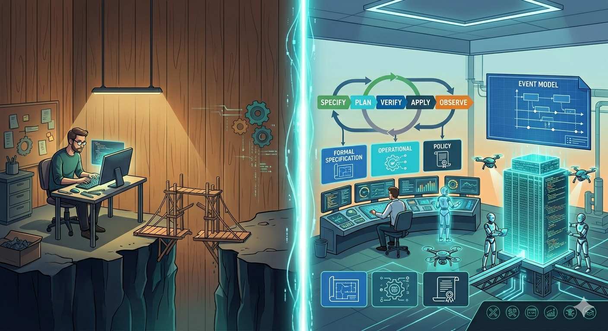

---

> **Thesis:** Agentic software engineering already works in craft environments, but it yields incremental gains, not transformational ones. The difference between a 10% productivity improvement and a 10× one lies in the same foundational elements that professionalized civil engineering: formal specification, material science, simulation, verification, and institutional accountability. Agentic AI is the forcing function that makes this professionalization economically inevitable, not merely desirable. Event Modeling, extended with experience, operational, and policy constraints, provides the specification language. The Decider pattern makes those specifications executable as pure functions. Event Sourcing grounds the model in an immutable, append-only record that extends verification, audit, and drift detection from design time into production. Operationalized through a Terraform-analogous lifecycle (Specify → Plan → Verify → Apply → Observe), this constitutes a viable path to industrial-grade outcomes. Crucially, this is not unprecedented: infrastructure provisioning has already undergone exactly this transformation, enabled by civil engineering itself.

---

### Executive Summary

- Agentic AI already works in **craft environments**, but yields incremental (10%) gains. Reaching **10× productivity** requires a formal engineering discipline: specification, verification, and accountability.
- This is the shift from **human in the loop** (micro-managing) to **human on the loop** (managing).
- **Agentic AI is the forcing function** for this professionalization: the competitive pressure it creates makes the transformation economically inevitable, not merely desirable.
- Civil engineering's six pillars (formal specification, material standards, codes, simulation, licensure, education) define the gap software must close.
- This transformation has precedent: **infrastructure provisioning** already moved from craft to engineering via Terraform's declarative lifecycle.
- **Event Modeling** provides a specification language for product-level behavior that is both human-readable and machine-verifiable.
- The **Decider pattern** makes Event Modeling specifications executable as pure functions, enabling simulation before implementation, just as structural analysis proves a design before construction.
- A unified specification model (behavioral + experience + operational + policy layers), operationalized through a **Specify → Plan → Verify → Apply → Observe** lifecycle, extends the infrastructure paradigm to products.
- This narrows the business-technical divide: the specification *becomes* the product.
- Open gaps remain in professional licensure, formal education, and industry standards: institutional debt the profession has yet to repay.

---

## 1. The Problem: Software as Craft in the Age of Agents

Software development today operates predominantly as a craft tradition. Individual developers carry implicit knowledge, develop personal styles, solve problems through intuition honed by experience, and transfer expertise through apprenticeship models \[1\]. The Software Craftsmanship movement formalized this identity explicitly, positioning software production as a practice closer to artisanship than engineering, emphasizing mastery, mentorship, and the irreducibility of human judgment \[2\].

This model has produced remarkable results. Much of the world's best software emerged from the deep intuition of skilled practitioners who understood their domains, their tools, and their users in ways that resist formalization.

But it caps the gains of agentic engineering at incremental improvement: the difference between 10% faster and 10× faster.

This article addresses industrialized software production: systems where reliability, auditability, and long-term maintainability are non-negotiable. Exploratory prototypes, R&D spikes, and one-off scripts have different economics and different constraints.

> "AI does not remove the need for careful engineering. On the contrary, it punishes the absence of it." — Juliette van der Laarse \[12\]

Agentic software engineering (the delegation of implementation tasks to autonomous AI agents \[3\]) already works in craft environments. Developers use LLM-based tools to generate code, refactor modules, and accelerate routine tasks. But agents operating on informal specifications, implicit conventions, and craft knowledge stored in practitioners' heads rather than in artifacts hit a ceiling quickly: they can assist artisans, but they cannot reliably replace the artisanship. When design decisions, domain heuristics, and quality criteria exist only in the minds of experienced developers, there is nothing stable for an agent to build upon. Scaling from copilot-level assistance to autonomous, end-to-end product delivery requires a substrate that agents can operate on: specifications formal enough to be unambiguous, verification criteria objective enough to be machine-evaluable, and architectural constraints explicit enough to be enforceable without human judgment.

The implication: **the difference between modest and transformational productivity gains from agentic engineering is not better AI; it is better engineering.** Formalized practices, specifications, and verification mechanisms that characterize mature engineering disciplines.

The vocabulary for this shift already exists, borrowed from autonomous systems design: **human in the loop** vs **human on the loop** \[24\]. A developer who reviews every line an AI agent produces is in the loop: they micro-manage agents, approving each artifact before it can proceed. A team that defines formal specifications, sets verification criteria, and monitors outcomes while agents execute independently is on the loop: they manage the engineering process, not each individual action, just as a foreman who commissions blueprints and dispatches inspectors can coordinate hundreds of workers precisely because they do not inspect each brick. Moving from "in" to "on" is the 10% → 10× transition, and it requires the same thing in software that it required in civil engineering: a specification and verification infrastructure that replaces micro-management with management.

> "The 'in the loop' way is to fix the artefact… The 'on the loop' way is to change the harness that produced it." — Kief Morris \[24\]

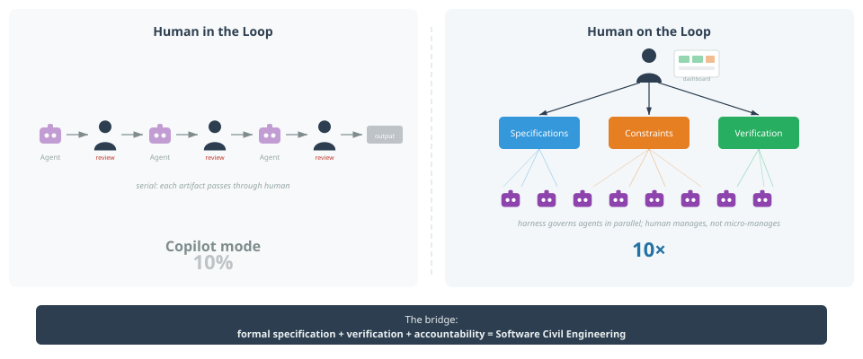
*From micro-managing agents to managing the engineering process.*

This is why the current excitement around LLM-based code generation, while justified, understates the real opportunity. Generative AI has made the construction workers faster, but the bottleneck in civil engineering was never the bricklaying. It was the blueprints, the structural calculations, the material specifications, the building codes, and the accountability framework. Software faces the same asymmetry: faster code production accelerates the construction, but none of the six disciplinary pillars outlined below.

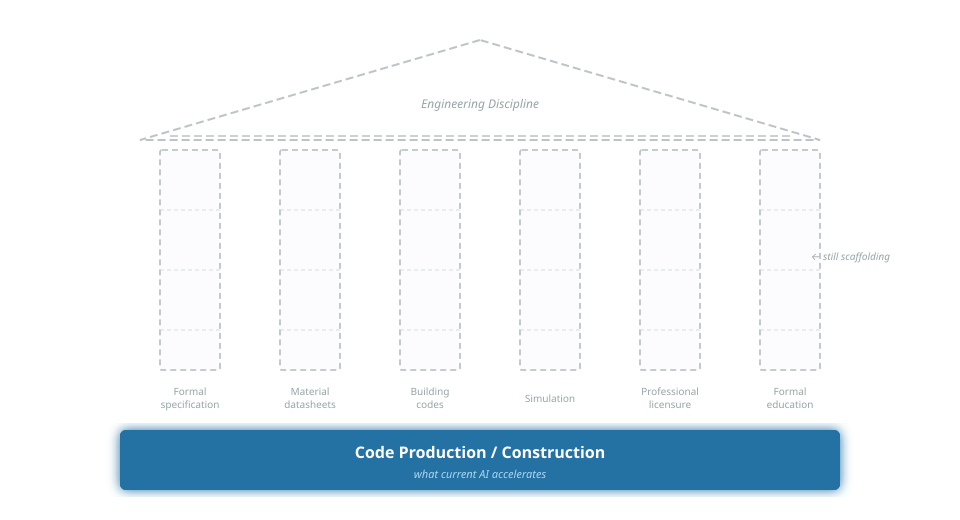

*Current AI investment accelerates construction. The six disciplinary foundations remain scaffolding.*

This is not merely a tooling problem. It is a disciplinary transformation analogous to the one that civil engineering underwent in the 19th century, and examining that parallel reveals both the path forward and the institutional gaps that remain.

## 2. The Civil Engineering Parallel

### 2.1 What defines an engineering discipline?

Civil engineering rests on six foundational pillars that collectively distinguish it from building-as-craft [4, 5]:

1. **Formal specification and verification.** Architects produce detailed blueprints; structural engineers produce load calculations. Both are formal artifacts that can be independently verified before construction begins.

2. **Standardized material datasheets.** Steel has a known tensile strength. Concrete behaves predictably under compression. Engineers do not test every beam; they rely on certified material specifications with known properties.

3. **Building codes and norms.** EuroCode, the International Building Code, national regulations. These represent accumulated collective knowledge formalized as enforceable standards, the profession's institutional memory.

4. **Simulation and modeling.** Tools like Simulink, finite element analysis, and computational fluid dynamics allow engineers to verify designs against physical laws before a single component is manufactured. The design is proven before realization.

5. **Professional licensure and liability.** A licensed civil engineer places their personal signature on calculations. Legal accountability is assigned to named individuals. When a bridge collapses, responsibility is traceable.

6. **Formal education and examination.** Engineering degrees are standardized, accredited, and require demonstrated competence in specific knowledge domains through rigorous examination.

### 2.2 Software development's current position

Mapped against these pillars, software development's disciplinary immaturity becomes visible. The six pillars expose six gaps, each of which demands a corresponding mechanism:

| Pillar                 | Civil Engineering                      | Software Development Today                                                                  |
| ---------------------- | -------------------------------------- | ------------------------------------------------------------------------------------------- |
| Formal specification   | Blueprints, structural calculations    | Informal user stories, ad-hoc documentation                                                 |
| Material datasheets    | Certified steel grades, concrete specs | No standardized performance profiles for frameworks, patterns, or infrastructure components |
| Codes and norms        | EuroCode, building regulations         | Fragmentary (OWASP, SOC2, AWS/Azure WAF), but no unified engineering standard               |
| Simulation             | FEA, Simulink, CFD                     | Almost nonexistent for application logic; limited to infrastructure (load testing)          |
| Professional licensure | PE license, personal liability         | None; no individual accountability for engineering decisions                                |
| Formal education       | Accredited, standardized, examined     | Highly variable; no required competency demonstration                                       |

This is not an argument that software development is *inferior* to civil engineering. It is an observation that software development lacks the institutional and methodological infrastructure that would allow autonomous agents to operate at industrial scale. Software's freedom from physical constraints is precisely what makes formal specification essential: there are no material properties to catch design errors; only the specification stands between intent and defect. AI agents can already assist craft practitioners, but scaling from copilot to autonomous production requires the formalized substrate that engineering disciplines provide.

> "The architectural sins that a human team could tolerate — the hidden coupling, the undocumented side effects, the modules that only make sense if you know the history — are fatal to AI-assisted development." — Ian Bull \[13\]

### 2.3 The infrastructure precedent

Yet this transformation from craft to engineering is not without precedent in the software domain. Infrastructure provisioning has already undergone exactly this journey.

A decade ago, provisioning a server was craft work: manual, unreproducible, and dependent on individual knowledge. Reliability engineering named the problem: servers were "pets," individually maintained, and irreplaceable.

> "Pets are servers you name and nurse back to health. Cattle are numbered and replaced." — Bill Baker

Handcrafted code is the same: individually authored, intimately understood by its creator, and painful to lose. The shift from pets to cattle required making infrastructure reproducible by specification rather than by hand. Configuration management tools (Ansible, Chef, Puppet) codified the steps imperatively, but remained sequences of instructions rather than engineering specifications. The decisive shift came with Terraform and the Infrastructure as Code (IaC) paradigm \[9\], where engineers began declaring *what* the infrastructure should be rather than *how* to provision it. This introduced the elements of a genuine engineering discipline:

- **Declarative specification** — `.tf` files describe the desired state, not the steps to achieve it.
- **State management** — a state file records what actually exists right now, enabling diffing against the declared specification.
- **Plan before apply** — `terraform plan` shows exactly what will change before any mutation occurs.
- **Controlled execution** — `terraform apply` realizes the verified plan in a reproducible, auditable manner.
- **Providers** — plugins that encode the properties, constraints, and behaviors of specific technical substrates (AWS, Azure, GCP).
- **Drift detection** — continuous comparison of actual state against declared specification.

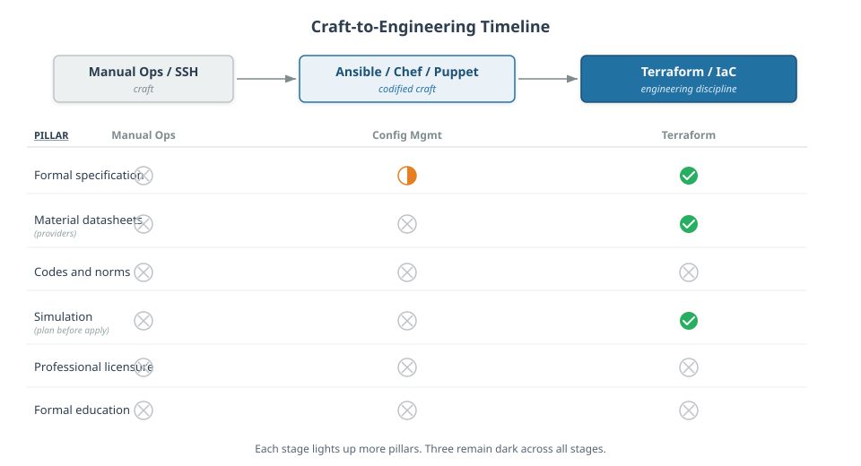

*Each evolutionary stage lights up more pillars. Three remain dark, foreshadowing Section 10.*

The parallel to the six civil engineering pillars is not accidental. This transformation was *enabled* by civil engineering itself. The hyperscale datacenters on which cloud computing rests are civil engineering projects in the most literal sense: formally specified, built with certified materials, verified against building codes. Civil engineering principles did not merely inspire the IaC transformation; they made it physically possible by providing the reliable substrate on which declarative infrastructure could be built.

**If infrastructure provisioning could be transformed from craft to engineering, can digital product development undergo the same transformation?** The remainder of this article argues that it can, and that Event Modeling provides the specification language to make it happen.

## 3. Spec-Driven Development and Event Modeling

### 3.1 The specification problem

Formal methods in software (Z-notation, B-method, TLA+) succeeded in safety-critical domains but failed to reach mainstream adoption, not because the concept was wrong but because the interface was \[6\]. These approaches required mathematical sophistication that most practitioners lacked and produced specifications that domain experts could not read. The specification language was divorced from both the problem domain and the implementation domain.

> "The craft has always been figuring out *what* code to write. Any given software problem has dozens of potential solutions, each with their own tradeoffs." — Simon Willison \[14\]

Spec-Driven Development (SDD) addresses this by making the specification the primary artifact from which implementation flows. The specification is not documentation *about* the system; it *is* the system definition \[7\].

### 3.2 Event Modeling as SDD done right

Event Modeling, as developed by Adam Dymitruk, resolves the interface problem that plagued earlier formal methods \[8\]. It expresses system behavior in a language that domain experts, product managers, and engineers can all read: commands, events, and views arranged on a timeline. Yet it is sufficiently formal to be deterministic and verifiable.

An Event Model specifies:

- **Commands**: what actions the system accepts
- **Events**: what facts the system records (immutable, ordered)
- **Read Models / Views**: how the system presents information derived from events

Each vertical "slice" through the model constitutes one or more Given-When-Then specifications:

- **Given** a set of prior events (system state)
- **When** a command is issued
- **Then** specific events are produced and views are updated

This is the critical property: **each slice is an independently verifiable, deterministic specification of behavior.** An AI agent implementing a slice does not need to "understand" the business logic; it needs to produce code that satisfies the Given-When-Then contract. Just as a construction worker does not need to understand why a load-bearing wall is positioned where it is, only that the blueprint says it must be there.

The intuition is familiar to anyone who has handled a LEGO brick. LEGO pieces are not identical: plates, beams, slopes, and axles each serve different purposes, just as slices come in a small set of distinct structural patterns. Yet every piece connects through the same stud-and-tube interface, and that universal connection system is what makes infinite combinations possible. The Given-When-Then contract(s), grounded in events on a shared timeline, serves the same function for slices: it is the interface that lets independently built pieces click together into a coherent system. This is the opposite of a jigsaw puzzle, where each piece fits exactly one position and the whole cannot be assembled out of order. LEGO bricks, like slices, are composable: the same pieces that build a castle also build a spaceship.

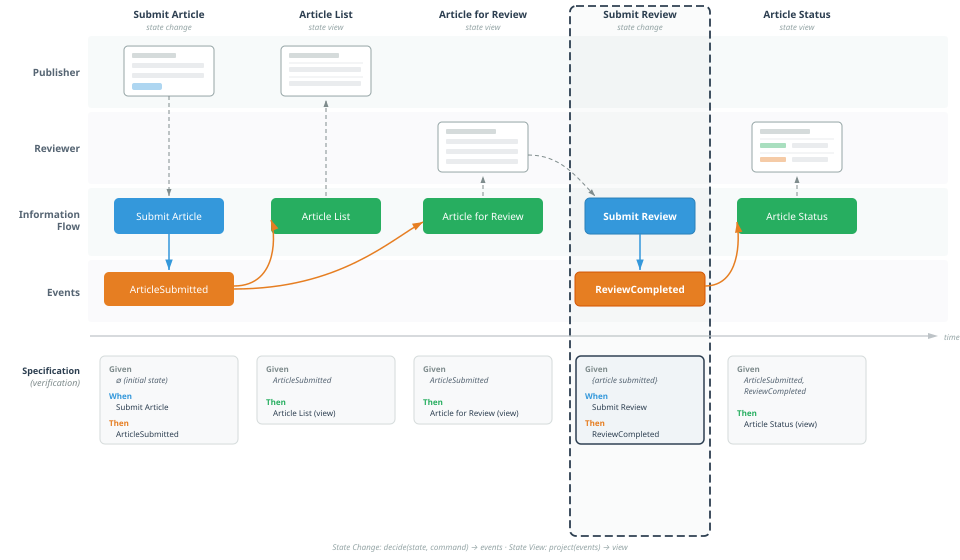

*Each vertical slice is an independently verifiable Given-When-Then contract.*

Event Modeling provides a second critical property: **information completeness**. For every field displayed in a view, the model requires a traceable path backward through events to the command where that data originally entered the system. If a view shows data that no event carries, and no command ever captured, the specification has a gap: a "made-up fact," in Adam Dymitruk's framing. This is verifiable at design time by following information flow across the blueprint; tooling can automate it through field-by-field mapping, flagging missing connections before a single line of code is written. As the Event Modeling specification puts it: "All information has to have an origin and a destination. Events must facilitate this transition and hold the necessary fields to do so."

This is the blueprint completeness check that civil engineering demands. In structural engineering, a blueprint is reviewed for completeness before construction begins; no load path may be left unresolved. Information completeness performs the same function for behavioral specifications. For agent-driven development, the implication is direct: an AI agent implementing a slice will never discover mid-implementation that a view requires data no event captures. The specification gap surfaces at design time, not during coding, eliminating an entire category of rework that plagues informal specifications, where the question "where does this data come from?" typically surfaces only during implementation.

### 3.3 What Event Modeling provides, and what it lacks

Event Modeling solves the *behavioral specification* problem. It provides the software equivalent of an architectural blueprint: a complete, readable, verifiable description of what the system does.

But civil engineering blueprints are not the only specification artifact. They are supplemented by structural calculations, material specifications, and building code compliance documentation. Event Modeling, in isolation, specifies behavior but says nothing about:

- **Performance characteristics**: latency, throughput, scalability under load
- **Operational requirements**: resilience, failover, resource budgets
- **Security and compliance invariants**: encryption, access control, audit requirements
- **Technical substrate properties**: how specific technology choices affect system behavior at scale
- **Experience and habitability**: how users perceive, navigate, and interact with the system; accessibility; cognitive load; affordances and feedback

These gaps must be filled for the engineering analogy to hold.

## 4. From Infrastructure to Products, and Beyond Terraform

### 4.1 Lifting the abstraction level

Terraform operates at the *infrastructure* level: it specifies resources, not behavior. Lifting the abstraction to the product level produces something fundamentally different:

> "I want a scholar publishing system where a publisher can submit an article, a compliance check verifies funder mandates automatically, and a dashboard shows status in real time — with max 200ms latency, SOC2-compliant, scalable to 50,000 active publications."

This declaration spans behavior, constraints, and operational requirements simultaneously. The specification lives at the product level, and the "engine" (AI agents, human developers, or a hybrid) realizes it.

### 4.2 Where the analogy diverges: simulation before production

Terraform's lifecycle handles state transitions, but software products *behave.* A scholar publishing system processes thousands of concurrent submissions, enforces compliance rules that change mid-workflow, and must respond gracefully when a funder alters its open-access mandate during an active publication cycle. A state-transition diff cannot answer these behavioral questions.

What we need is the declarative lifecycle *plus* the ability to simulate behavior before production, to prove the design before realization. The question is: what gives us that simulation capability at the product level?

### 4.3 The Decider pattern: Plan for domain logic

The answer lies in a pattern that connects Event Modeling directly to verifiable execution: the Decider pattern, formalized by Jérémie Chassaing \[17\].

A Decider is a pure, deterministic function: given the current state (derived from prior events) and a command, it produces the resulting events. No side effects, no infrastructure dependencies, no network calls. Just input, logic, output.

This purity is not accidental; it is an architectural choice. The Functional Core / Imperative Shell pattern (Gary Bernhardt, 2012 \[19\]) structures software so that all decision logic lives in pure functions at the center — the functional core — while all side effects (database I/O, HTTP, messaging) are pushed to a thin outer layer — the imperative shell. The Decider's `decide` and `evolve` functions ARE the functional core: values in, values out, no I/O. Event store persistence, endpoint handling, and event publishing are the imperative shell: thin wiring that orchestrates the core but contains no business logic.

This separation is what makes simulation possible. Just as structural engineers analyze forces using mathematical models — pure abstractions that operate on numbers, not on physical materials — the functional core allows a design to be proven before realization. Without this architectural discipline, business logic is entangled with I/O, and "structural analysis" requires standing up databases, configuring infrastructure, and deploying services. The near-zero-cost simulation that Deciders enable is a property of the architecture that makes the pattern's purity achievable, not of the pattern alone.

This is `terraform plan` for domain logic: a pure preview of what *would* happen, runnable against a thousand scenarios without touching a database.

The mapping to Event Modeling is direct. Each Given-When-Then verification in an Event Model maps naturally to a Decider invocation:

- **Given** prior events → the Decider's current state (via its `evolve` function)
- **When** a command is issued → the Decider's input
- **Then** specific events are produced → the Decider's output

Paired with Deciders, an Event Model becomes more than a specification document; it becomes a *simulation suite.* Each slice defines scenarios that can be executed as pure functions, verified deterministically, and repeated indefinitely at near-zero cost. The blueprint is also the structural analysis. (Event Modeling does not prescribe the Decider pattern; many practitioners use DDD aggregates or other approaches to implement slices. But the Decider's purity makes it a natural fit, just as Event Sourcing is a natural fit for the persistence model: separate patterns that complement each other precisely; the note below on Dynamic Consistency Boundaries shows how the Decider's type structure generalizes this further.)

But verification is only half the value of near-zero-cost simulation. The other half is *experimentation*. When each scenario executes as a pure function call, the cost per experiment drops so dramatically that the question shifts from "can we afford to test this alternative?" to "can we afford *not* to?" Instead of verifying one design, teams can explore dozens: alternative command flows, different event granularities, competing business rules, all executed against the same Given-When-Then contracts without deploying a single service.

Pixar's storyboard process demonstrates the same principle in a creative domain. Each 90-minute film cycles through roughly eight iterations of increasing fidelity, from outline to storyboard to animation, producing approximately 2,700 storyboard drawings before a single frame of expensive animation begins \[23\]. The storyboard is the cheap medium; animation is the expensive one. The Decider pattern provides the same economics for domain logic: pure functions are the cheap medium, deployed infrastructure is the expensive one. Experiment in the former, converge before committing to the latter.

This counters a common misconception: that formal specification slows iteration, that it is waterfall by another name. The opposite holds. Informal specifications force experimentation into staging environments and production, where each experiment requires infrastructure, deployment, and time. Formal specifications with pure-function simulation move experimentation upstream, where it is fast, free, and unlimited. The more formal the specification, the cheaper each experiment; the cheaper each experiment, the more experiments teams can afford; the more experiments, the faster they learn. As Stefan Thomke's research on innovation demonstrates, reducing the marginal cost of experiments is the single strongest lever for increasing the rate of learning \[29\].

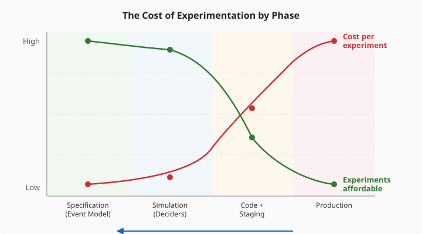

*Moving upstream reduces cost per experiment; the number of affordable experiments rises in inverse proportion.*


*The Decider cycle: decide(state, command) → events; evolve(state, event) → state.*

> [!info] Beyond the aggregate: Dynamic Consistency Boundaries.
> The Decider as presented above uses symmetric types: the events it consumes are the same events it produces, and its state type is the same going in as coming out. In type terms this is `AggregateDecider<C, S, E>`, which maps one-to-one with the traditional DDD aggregate and its single event stream. But the Decider's algebraic structure is more general. The fully parameterized form is `Decider<C, Si, So, Ei, Eo>`, with five independent type parameters; the intermediate form `DcbDecider<C, S, Ei, Eo>` constrains state to be symmetric (Si = So) while keeping input and output event types distinct (Ei ≠ Eo). Set-theoretically: AggregateDecider ⊂ DcbDecider ⊂ Decider \[27\].
>
> The practical consequence is significant. When a decider can consume events it did not produce, consistency boundaries become dynamic: they are defined by *which events you query*, not by which aggregate you belong to. New invariants that span what were previously separate aggregates require no structural migration; you simply widen the query. Sara Pellegrini and Milan Savic's Dynamic Consistency Boundary (DCB) pattern \[28\] operationalizes this by replacing per-aggregate event streams with a single stream per bounded context and enforcing consistency through query-based optimistic locking (an append condition on event tags) rather than stream-revision locking. Some practitioners argue this is how event sourcing should be defined by default, with the aggregate as an intentional narrowing rather than the starting point.
>
> The tradeoff: a single stream per bounded context requires global ordering within that context, which is harder to partition horizontally than per-aggregate streams. For the thesis of this article, the key point is that the Decider pattern is not a single fixed shape; it is a family of progressively constrained types whose most general form enables slicing flexibility that traditional aggregates cannot match.

### 4.4 The six elements: a structural isomorphism

The gap analysis in Section 2 posed six questions; the Terraform lifecycle and the Decider pattern now provide answers:

| Element             | Terraform (Infrastructure)                              | Civil Engineering                                  | Product Level                                                                           |
| ------------------- | ------------------------------------------------------- | -------------------------------------------------- | --------------------------------------------------------------------------------------- |
| **Specification**   | `.tf` files — declarative desired state                 | Blueprints + structural calculations               | Event Model + Experience Model + Operational/Policy Constraints                         |
| **Providers**       | Plugins encoding substrate properties (AWS, Azure, GCP) | Material datasheets (steel grades, concrete specs) | Technical substrate profiles (DB latency, broker throughput, framework characteristics) |
| **State**           | `.tfstate` — what actually exists now                   | As-built documentation                             | Current system state representation for diffing                                         |
| **Plan**            | `terraform plan` — diff + changeset preview             | Structural analysis, bill of materials             | State diff + Decider-based behavioral simulation                                        |
| **Apply**           | `terraform apply` — controlled execution                | Construction by licensed contractors               | AI agents implement verified plan                                                       |
| **Drift detection** | Actual vs. desired state comparison                     | Building inspection, structural monitoring         | Production event stream validation against specification                                |

The critical difference is in the **Plan** element. Terraform's plan is a state diff, necessary but insufficient for products. The product-level plan adds behavioral simulation via Deciders: not just *what needs to change*, but *whether the changed system will behave correctly*. This is where Software Civil Engineering extends the infrastructure paradigm.

### 4.5 The unified specification model

Combining these elements produces a unified model:

```
Specification {
    EventModel      → behavior (commands, events, views)
    ExperienceModel → habitability (interactions, accessibility, cognitive load)
    Deciders        → executable behavioral contracts (pure functions)
    Providers       → technical substrate with known properties
    Constraints     → NFRs, policies, budgets
}

Plan     = diff(CurrentState, Specification) + simulate(Deciders, Scenarios)
Verify   = evaluate(Plan, against: Constraints)
Apply    = agents.implement(Plan)
Observe  = drift_detection(Production, Specification)
```

This lifecycle — **Specify → Plan → Verify → Apply → Observe** — is the operational core of Software Civil Engineering.

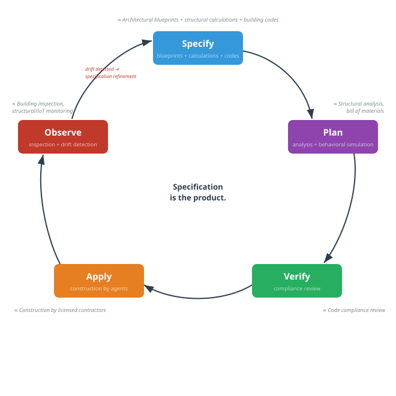
*Specify → Plan → Verify → Apply → Observe, with drift feeding back into specification refinement.*

## 5. The Four Specification Layers

The unified specification requires four distinct but integrated layers, each addressing a different class of engineering concern.

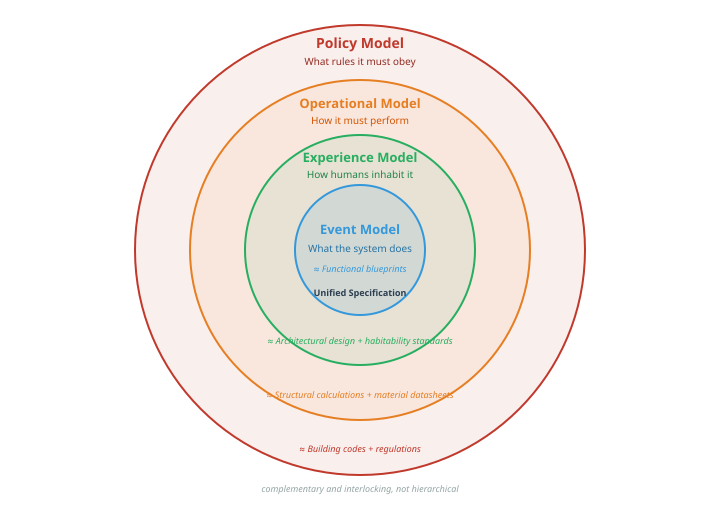
*Four complementary layers constitute the unified specification.*

### 5.1 The Event Model: behavioral specification

This is the core: what the system *does*. Commands it accepts, events it records, views it presents. Each slice is a Given-When-Then contract that is independently implementable and verifiable.

**Verification method:** Scenario simulation at design time; automated acceptance tests derived from Given-When-Then specifications at implementation time; event stream validation against the model at runtime.

**Civil engineering analog:** Architectural blueprints, the functional design of the structure.

### 5.2 The Operational Model: substrate specification

This layer describes the system's operational characteristics and the known properties of its technical substrate. It includes:

- **Load profiles**: normal and peak usage scenarios with quantified expectations
- **Failure modes**: what happens when components degrade or fail
- **Resource budgets**: memory, CPU, network, and storage constraints per component
- **Provider characteristics**: known performance profiles of the specific technology stack (database latency characteristics, message broker throughput, framework overhead)

**Verification method:** Load simulation before implementation; performance testing against budgets during implementation; anomaly detection against load profiles at runtime.

**Civil engineering analog:** Structural calculations and material datasheets, the physical properties that determine whether the design is feasible.

### 5.3 The Policy Model: invariant specification

This layer captures constraints that must hold everywhere, always, regardless of specific behavior or operational context:

- Security policies (encryption at rest, authentication requirements, access control rules)
- Compliance requirements (audit trail retention, data residency, regulatory mandates)
- Architectural invariants (no synchronous cross-boundary calls, all state changes via events, no direct database access from UI layer)

**Verification method:** Static analysis and automated policy enforcement at implementation time; adversarial testing (security scanning, penetration testing) at verification time; continuous compliance monitoring at runtime.

**Civil engineering analog:** Building codes and regulations, the non-negotiable constraints that override design preferences.

### 5.4 The Experience Model: habitability specification

A building can satisfy every structural code and still be uninhabitable: poorly lit, acoustically hostile, inaccessible, disorienting. The structural engineer certifies that the building will not fall down; the architect ensures that people will want to live in it. These are distinct competencies addressing distinct failure modes, and civil engineering treats them as such.

Software faces the same duality. A system can pass every Given-When-Then contract, meet every latency budget, and satisfy every compliance invariant while remaining unusable: confusing interactions, missing affordances, inaccessible interfaces, overwhelming cognitive load. The first three specification layers, Behavioral, Operational, and Policy, correspond to the structural engineer's domain. The Experience Model corresponds to the architect's: it specifies the conditions under which the system is not merely correct but *habitable*.

Don Norman's concept of *affordances*, the perceived and actual properties of an object that suggest how it can be used \[25\], provides the foundational vocabulary. A door handle affords pulling; a flat plate affords pushing. When the affordance contradicts the required action, users fail, not because the mechanism is broken but because the design is uninhabitable. Software interfaces exhibit the same pathology: a button that looks disabled but is clickable, a workflow that requires six steps where the user's mental model expects two, an error message that names an internal exception rather than a recovery path.

The Experience Model specifies:

- **Interaction flows and affordances**: how users perceive available actions and system state; the mapping between user intent and system response
- **Accessibility requirements**: WCAG conformance levels, assistive technology support, inclusive design constraints
- **Information architecture**: cognitive load budgets, navigability, learnability expectations
- **Feedback and error recovery**: system status visibility, error messaging, recovery paths

**Verification method:** Heuristic evaluation and cognitive walkthrough at design time; automated accessibility testing and interaction pattern conformance at implementation time; user behavior analytics at runtime (see Section 6.1, Loop 3).

**Civil engineering analog:** Architectural design and habitability standards, the specifications that ensure a structure is not merely safe but livable.

## 6. The Eval System: Software's Simulation Engine

### 6.1 Three verification loops

The simulation capability for software is not a single tool but a system of three eval loops that operate at different phases, each leveraging the Decider pattern's property of pure, side-effect-free execution:

**Loop 1 — Design-time simulation.**
Before any code is written (by human or agent), the Deciders derived from the Event Model are executed against scenarios. "What happens if a publisher submits 10,000 articles simultaneously? What happens if a funder changes its open-access mandate mid-publication?" Because the Functional Core / Imperative Shell architecture confines all decision logic to pure functions, these simulations run at near-zero cost: no databases, no infrastructure, no deployment. The flow is simulated through the event timeline to find logical errors, missing events, and inconsistent states. This is the structural analysis step: proving the design before realization. In parallel, the Experience Model is verified through heuristic evaluation and cognitive walkthrough: do the specified interaction flows match user mental models? Are affordances consistent? Are accessibility requirements met by the proposed design?

**Loop 2 — Implementation-time evals.**
When an AI agent implements a slice, the generated code is executed against an eval set *derived automatically from the Event Model.* Each Given-When-Then scenario (each Decider contract) becomes an automated acceptance test. The agent "passes" only if the code satisfies the specification, not vaguely but deterministically. Operational Model constraints add quantitative verification: the implementation must also meet latency budgets, resource limits, and resilience requirements. Policy Model constraints add invariant checks: security scanning, compliance verification, architectural conformance. Experience Model constraints add habitability checks: automated accessibility testing (WCAG conformance), interaction pattern conformance against the specified flows, and cognitive load verification against information architecture budgets.

**Loop 3 — Runtime verification.**
In production, actual events are validated against the expected model. Anomaly detection identifies patterns that should never occur according to the specification. Event sourcing provides a significant advantage here: the complete, immutable event log is a natural audit trail and verification corpus. Drift detection (the `terraform plan` equivalent) continuously compares production behavior against the specification and flags divergence. The Experience Model adds a distinct runtime signal: *desire path detection.* In landscape architecture, desire paths are the trails worn into grass by pedestrians who bypass the designed walkways; some universities now wait to see where students actually walk before paving paths. The software equivalent is user behavior analytics that reveal where users deviate from designed interaction flows, retry unexpectedly, abandon tasks, or improvise workarounds. These are not specification violations in the behavioral sense (the system did what the Event Model said); they are habitability failures (the system did what was specified, but what was specified does not match how humans actually work). Desire path data feeds back into the Experience Model, closing the loop between specified habitability and observed habitability.

> [!info] A pioneer in practice.
> Datadog's engineering organization has demonstrated that layered verification from formal specification to production telemetry is practically achievable \[18\]. Their approach layers formal specifications (TLA+) → deterministic simulation testing → model checking → formal verification → production telemetry, creating a closed loop where production observations refine the verification harness. While applied to infrastructure-level systems rather than product-level specification, their work shows that the verification pyramid this article proposes is not theoretical. It is an emerging engineering practice whose principles are ready to be lifted to the product level.

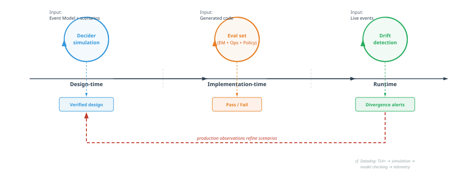
*Design-time simulation, implementation-time evaluation, runtime drift detection, with production feeding back into design.*

### 6.2 Adversarial verification

A critical extension of the eval system: rather than a single agent that builds and self-verifies, the model calls for *adversarial* AI verification, with separate agents that attempt to break implementations:

- A **security agent** that probes for vulnerabilities against the Policy Model
- A **load agent** that stress-tests against the Operational Model
- A **consistency agent** that verifies behavioral correctness against the Event Model
- A **habitability agent** that evaluates accessibility conformance, interaction consistency, and cognitive load against the Experience Model

This mirrors civil engineering practice where the structural engineer who verifies a design is independent of the architect who created it. Trust is placed in the verification system, not in the implementer's self-assessment.

## 7. Narrowing the Business-Technical Divide

### 7.1 Specification as strategy

If the specification encompasses behavior, experience, operational characteristics, and policy constraints, then **the specification is the product**, and the historical separation between "the business side" and "the tech side" narrows sharply. A product leader who defines "publishers need real-time compliance checking with sub-second response times, accessible to screen readers, with clear status feedback at each step" is simultaneously writing behavioral specification (Event Model), experience requirements (Experience Model), performance requirements (Operational Model), and compliance constraints (Policy Model). No translation step. No alignment ceremony. One model.

### 7.2 Specification ownership as leadership function

This has organizational implications. If specification ownership determines product direction, technical feasibility, and operational characteristics simultaneously, then it is not an architecture function. It is a **leadership function.**

An architect operates within given constraints: they receive a problem and design the optimal technical solution. A leader defines the constraints: they determine which problems to solve, with what properties, and in what order.

The person or team that controls the specification controls the product. This is a strategic leadership responsibility, not a technical delegation. It requires the ability to:

- Facilitate Event Modeling to extract and formalize business behavior
- Define provider characteristics with sufficient technical understanding
- Express constraints formally with engineering judgment
- Prioritize and sequence slices with product strategic awareness

### 7.3 Scaling specification through governance

If specification ownership is a leadership function, it does not scale by hiring more architects. It scales by formalizing the specification format sufficiently that leadership can delegate *parts* of the specification work without losing coherence.

This requires a governance mechanism analogous to infrastructure-as-code change management: pull requests on the specification, not on the code. Domain teams may propose new slices in the Event Model, but constraint definitions and provider selections may require leadership validation. The specification becomes a governed artifact with access controls, review processes, and audit trails, just as building permits require review and approval before construction begins.

## 8. Implications for Roles and Organizations

### 8.1 What becomes more valuable

In a Software Civil Engineering organization, the most valuable human capabilities shift dramatically:

- **Specification skills**: the ability to extract, formalize, and verify behavioral requirements through Event Modeling (or other context-aware specification-driven development technique) becomes the core professional competency
- **Harness engineering**: defining non-functional requirements, provider profiles, and eval criteria with sufficient formality for machine verification becomes a specialized discipline
- **Provider knowledge**: understanding the properties and limitations of technical substrates (databases, frameworks, infrastructure) becomes a form of materials science
- **Experience specification**: defining interaction flows, accessibility requirements, and cognitive load budgets with sufficient formality to be testable; the ability to distinguish habitable from merely functional
- **Verification design**: constructing eval systems that reliably catch specification violations becomes the quality function

### 8.2 What becomes less valuable

- **Individual coding virtuosity**: as agents improve, the ability to write elegant, performant code becomes less differentiating. The quality that matters shifts from implementation craft to specification precision.

> "Coding via agents requires more rigor, more structure, more code quality, not less." — Adam Tornhill \[15\]

- **Implicit technical knowledge**: the senior developer who "just knows" that a certain pattern will cause problems is increasingly supplemented by externalized constraint libraries and adversarial verification agents. The knowledge is preserved; the medium shifts progressively from human memory to formal artifact, though Section 10.4 acknowledges that some emergent judgment may resist full formalization.

### 8.3 New role archetypes

The traditional developer/architect/tech lead taxonomy gives way to roles organized around the specification lifecycle:

- **Domain Engineers**: facilitate Event Modeling, extract behavioral specifications from stakeholders, maintain the Event Model. Evolution of business analyst + domain architect.
- **Harness Engineers**: define operational and policy constraints, maintain provider profiles, design eval criteria — the integrated harness that makes agent autonomy safe. Evolution of performance engineer + security engineer + platform architect.
- **Experience Engineers**: specify interaction flows, accessibility requirements, and cognitive load budgets; design heuristic evaluation criteria; monitor user behavior analytics for habitability drift. Evolution of UX designer + accessibility specialist + interaction designer.
- **Quality Engineers**: build and maintain the eval system, design adversarial testing strategies, monitor production drift. Evolution of QA + SRE + compliance.
- **Specification Leads**: own the unified specification for a product area, govern changes, ensure coherence across behavioral, experience, operational, and policy layers. A leadership function, not an architecture role.

### 8.4 Functional convergence

The role archetypes above describe convergence at the individual level. The same specification-driven logic operates one level up: at the organizational function level.

Traditionally, product management owns "what to build," design owns "how it feels," and engineering owns "how it works." These are separate functions with separate reporting lines, separate tooling, and alignment ceremonies (roadmap reviews, design handoffs, sprint planning) to keep them synchronized. The ceremonies exist because each function maintains its own representation of the product, and the representations drift.

When the unified specification encompasses behavior (Event Model), experience (Experience Model), operational characteristics, and policy constraints, the boundaries between these functions dissolve. A specification that defines both what the system does and how users experience it is simultaneously a product artifact, a design artifact, and an engineering artifact. The alignment ceremony becomes redundant because there is one model, not three translations of it.

The three functions converge into a single R&D function organized around the specification lifecycle: Specify → Plan → Verify → Apply → Observe. This is not a merger of convenience; it is a structural consequence of specification unification. Product concerns map to the Behavioral and Policy layers, design concerns map to the Experience layer, and engineering concerns map to the Operational layer and provider knowledge. The specification is the shared language that makes functional boundaries unnecessary.

Foundation Capital's analysis of organizational restructuring in the age of AI agents observes this convergence independently: organizations are already collapsing "three traditional roles (product, engineering, design)" into unified structures \[26\]. What the market is discovering empirically, the specification model explains disciplinarily: when one artifact captures what to build, how it should feel, and how it must perform, maintaining three separate functions to govern those concerns is organizational overhead without engineering justification.

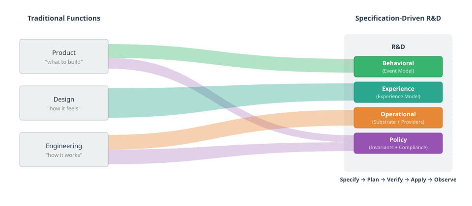

*Product, Design, and Engineering converge into specification-driven R&D.*

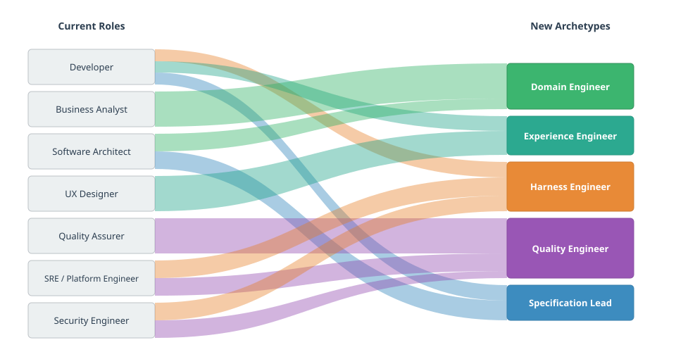

*Roles reorganize around the specification lifecycle, not the implementation lifecycle.*

## 9. Why AI Is the Forcing Function, Not Catastrophe

### 9.1 The positive professionalization thesis

Civil engineering professionalized *reactively*: bridges collapsed, buildings failed, people died, regulations followed \[10\]. It took decades and required political will.

Software Civil Engineering has a different forcing function: **economic opportunity, not catastrophe.** The productivity gap between formalized and unformalized organizations is already visible, and it will only widen as agent capabilities improve. Organizations that formalize their specifications sufficiently for agents to operate autonomously will pull ahead. This pressure is operating *now*.

That said, "not catastrophe" does not mean "without severe consequences." Scandinavian healthcare and government IT projects alone have consumed billions in public funds: Sweden's Millennium system (5.5 billion SEK, scrapped after three days \[20\]), Denmark's property valuation system (4 billion DKK, "astonishing low quality" \[21\]), Finland's Apotti patient system (€600M+, 600 doctors filing safety complaints \[22\]). Nobody died, but citizens were harmed, public trust eroded, and billions were lost.

These are not outliers. Bent Flyvbjerg's study of over 16,000 projects across 136 countries reveals that IT projects carry the worst cost-overrun distribution of any project type, with an average overrun of 447% \[23\]. Only 0.5% of megaprojects hit all three targets: budget, schedule, and benefits. Flyvbjerg's prescription is "Think slow, act fast" \[23\]: invest heavily in planning, where iteration is cheap, then execute rapidly to minimize exposure to disruption. The Decider pattern (Section 4.3) operationalizes this prescription: pure-function simulation is the mechanism that makes planning-phase iteration cheap, transforming "think slow" from an aspiration into an engineering capability. This is, in essence, the Specify → Plan → Verify lifecycle applied at the project level. His companion insight, that modular projects dramatically outperform monolithic ones, maps directly to Event Modeling's independently verifiable slices: big things made from small, composable things; LEGO bricks rather than jigsaw pieces.

> "Think slow, act fast. That's the secret of success." — Bent Flyvbjerg \[23\]

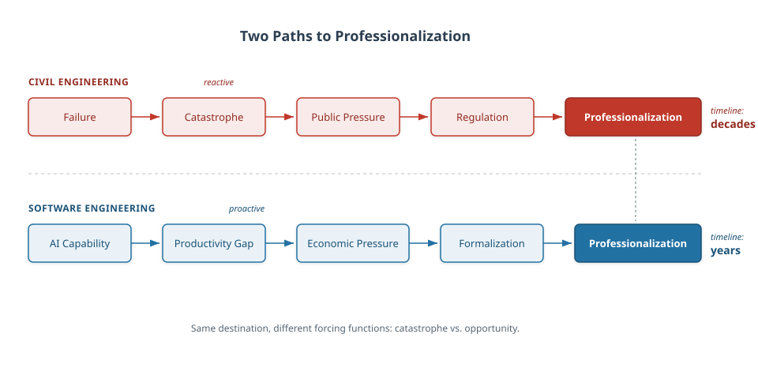

*Different triggers, different timescales, same outcome.*

> "The implementation itself can be replaced module by module in a few hours, keeping the design ideas and tests that define its behaviours. \[…\] We've just moved up a level." — Adrian Cockcroft \[16\]

### 9.2 The individual organization path

This also means professionalization need not be industry-wide to begin. Individual organizations can adopt Software Civil Engineering principles without waiting for industry standards, licensing requirements, or academic consensus. First movers gain compounding advantages: each formalized specification makes the next one easier, each eval system makes agent-produced code more reliable, and each successful agent-implemented slice builds organizational confidence and capability.

The transformation is self-reinforcing: formalization enables agents, agents validate the value of formalization, and the productivity gains justify further investment in specification quality.

## 10. Open Gaps and Institutional Debt

Intellectual honesty requires acknowledging what this model does *not* address. These gaps represent significant institutional debt that the software industry has not yet begun to repay:

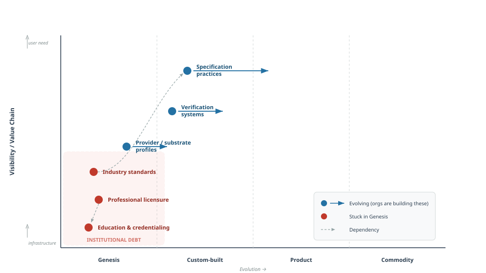

*Specification and verification are evolving; institutional foundations remain stuck in Genesis.*

### 10.1 Professional licensure and liability

Civil engineering assigns personal legal liability to named engineers. Software has no equivalent. When an AI agent produces code that causes harm (data loss, security breach, financial damage), who bears responsibility? The specification author? The AI provider? The organization?

This absence of accountability is not merely an institutional oversight; it reflects a deeper cultural assumption that software production does not warrant the same professional rigor as other engineering disciplines. Consider the contrast: search "can I be a software developer" and the top results assure you that anyone can, with minimal barriers to entry. Search "can I be a civil engineer" and you encounter years of formal education, licensing requirements, and professional accountability. If a firm contracted to build a bridge delivers a structure that collapses, legal liability follows. No such accountability exists for the firms building the digital infrastructure on which society increasingly depends. As Geoffrey Huntley puts it:

> "I fully believe that software engineering should be a licensed profession. \[…\] If you work at a company that's contracted to build a bridge, if that bridge collapses, then that company should get liability." — Geoffrey Huntley \[11\]

Without a liability framework, Software Civil Engineering lacks the accountability mechanism that forces rigor in other engineering disciplines.

**Consequence if unresolved:** Organizations may adopt formal specification practices for productivity reasons but lack the external forcing function that prevents corners from being cut. Quality becomes optional rather than legally mandated.

### 10.2 Formal education and credentialing

Civil engineers undergo standardized, accredited education with examined competency requirements. Software engineering education is fragmented, inconsistent, and often disconnected from professional practice. If specification skills become the core competency, there is no established pathway for developing and certifying them.

**Consequence if unresolved:** Specification quality will vary wildly between organizations and individuals, with no reliable signal of competence. Hiring and team formation become guesswork.

### 10.3 Industry-wide standards and norm-setting bodies

Building codes are maintained by institutions (ISO, national standards bodies, professional associations) that aggregate knowledge across the entire profession. Software has OWASP, NIST, Well-Architected Framework, and various compliance frameworks, but nothing approaching a unified engineering standard for specification, verification, or professional practice.

**Consequence if unresolved:** Each organization reinvents the specification format, the constraint taxonomy, and the verification criteria. Knowledge does not accumulate at the industry level, and best practices remain siloed.

### 10.4 The emergent complexity boundary

There exists a class of technical decisions that are genuinely emergent. They arise from the interaction between domain behavior, user context, technical substrate, and specific operational conditions in ways that resist formalization. "This event stream structure will create a hot partition given *our specific* usage pattern" or "this interaction flow will overwhelm users in *our specific* domain context" requires understanding of all four layers simultaneously in a context-dependent way. Whether this can be fully formalized or whether it represents a permanent boundary for the model remains an open question.

**Consequence if unresolved:** Some engineering decisions may permanently require human judgment, limiting the degree of agent autonomy achievable. This is not necessarily a failure (civil engineering also requires experienced engineers for novel structures), but it bounds the model's applicability.

## 11. Conclusion: The Disciplinary Moment

The infrastructure precedent proved that craft-to-engineering transformation is achievable within the software domain. The task now is to lift it from the infrastructure level to the product level.

Event Modeling, made executable through the Decider pattern and extended with Experience, Operational, and Policy layers, provides the specification language for this lift. Each Given-When-Then slice is simultaneously a specification, a test, and a simulation scenario, executable as a pure function without infrastructure. The Experience Model adds what structural calculations alone cannot: the assurance that what is built is not merely correct but habitable. Operationalized through the Specify → Plan → Verify → Apply → Observe lifecycle, the result is a viable foundation for Software Civil Engineering.

What follows from this is a paradigm where specification precision replaces implementation skill as the primary value driver, where technical leadership becomes specification governance, and where AI agents serve as the execution engine of a properly specified engineering process. The specification does not describe the product; it *is* the product, and the organizations that grasp this will not merely be more productive. They will be operating in a fundamentally different mode: quality *and experimentation* determined upstream, at the specification level, not downstream at the implementation level.

The bridges will not fall because they were designed not to.

---

## References

\[1\] S. Mancuso, *The Software Craftsman: Professionalism, Pragmatism, Pride*, Prentice Hall, 2014. Articulates the craft model as a deliberate professional identity for software development.

\[2\] R.C. Martin, "Manifesto for Software Craftsmanship," 2009. Formalizes the craft values of the software development community as a complement to the Agile Manifesto.

\[3\] A. Karpathy, "Software in the era of AI," 2025. Describes the shift toward agentic software engineering where AI agents perform implementation tasks autonomously.

\[4\] H. Petroski, *To Engineer Is Human: The Role of Failure in Successful Design*, Vintage, 1992. Traces the evolution of engineering disciplines through their responses to failure.

\[5\] E.T. Layton Jr., *The Revolt of the Engineers: Social Responsibility and the American Engineering Profession*, Johns Hopkins University Press, 1986. Examines the professionalization of engineering as a social and institutional process.

\[6\] J. Woodcock, P.G. Larsen, J. Bicarregui, J. Fitzgerald, "Formal methods: Practice and experience," *ACM Computing Surveys*, vol. 41, no. 4, 2009. Reviews the adoption challenges of formal methods in industrial software development.

\[7\] Spec-Driven Development as a methodology emphasizes specification as the primary development artifact from which implementation derives. Various formulations exist across API-first development, contract-first design, and formal specification approaches.

\[8\] A. Dymitruk, "Event Modeling," eventmodeling.org, 2019-present. Defines the Event Modeling methodology for specifying information systems through commands, events, and views on a timeline.

\[9\] HashiCorp, "Terraform: Infrastructure as Code," terraform.io. Declarative infrastructure provisioning using the Specify → Plan → Apply → Observe lifecycle.

\[10\] H. Petroski, *Design Paradigms: Case Histories of Error and Judgment in Engineering*, Cambridge University Press, 1994. Documents how engineering failures have driven professionalization and the development of formal standards.

\[11\] G. Huntley, interview in "AI Giants" podcast, Season 2, Episode 1, 2026. https://www.youtube.com/watch?v=ZBkRBs4O1VM&t=2227s. Discusses software engineering licensure, the ralph-loop pattern, and the distinction between software development and software engineering.

\[12\] J. van der Laarse, "Capability Architecture for AI-Native Engineering," O'Reilly Radar, 2025. https://www.oreilly.com/radar/capability-architecture-for-ai-native-engineering/. Argues that AI punishes the absence of engineering discipline and that scaling requires shared norms.

\[13\] I. Bull, "Sinks, Not Pipes: Software Architecture in the Age of AI," ianbull.com, 2025. https://ianbull.com/posts/software-architecture/. Examines how architectural honesty becomes a prerequisite for effective AI-assisted development.

\[14\] S. Willison, "Agentic Engineering Patterns," simonwillison.net, 2026. https://simonwillison.net/2026/Feb/23/agentic-engineering-patterns/. Catalogs emerging patterns for specification, verification, and iteration in agentic engineering workflows.

\[15\] A. Tornhill, "Agentic AI Coding: Best Practice Patterns for Speed with Quality," CodeScene Blog, 2025. https://codescene.com/blog/agentic-ai-coding-best-practice-patterns-for-speed-with-quality. Demonstrates that agentic coding demands more structural rigor and code health, not less.

\[16\] A. Cockcroft, "Directing AI Native Development," Medium, 2025. https://adrianco.medium.com/directing-ai-native-development-0914ac271744. Describes the shift from building-from-source to building-from-spec as a level change in software production.

\[17\] J. Chassaing, "Functional Event Sourcing Decider," thinkbeforecoding.com, 2021. https://thinkbeforecoding.com/post/2021/12/17/functional-event-sourcing-decider. Formalizes the Decider pattern as a pure function from (State, Command) → Events, providing the executable bridge between Event Modeling specifications and verifiable implementation.

\[18\] Datadog Engineering, "Closing the Verification Loop: Harness-First Agents," Datadog Blog, 2026. https://www.datadoghq.com/blog/ai/harness-first-agents/. Demonstrates layered verification from formal specifications (TLA+) through deterministic simulation testing to production telemetry, establishing the practical feasibility of specification-to-production verification pipelines.

\[19\] G. Bernhardt, "Boundaries," talk at SCNA, 2012. https://www.destroyallsoftware.com/talks/boundaries. Introduces the Functional Core / Imperative Shell architecture: push all decisions into pure functions; push all side effects to a thin outer layer. The architectural prerequisite that makes Decider-based simulation possible.

\[20\] Sweden Herald, "Now Millennium can be scrapped: 'Huge relief,'" 2025. https://swedenherald.com/article/proposal-scrap-the-millennium. Västra Götaland Region's 5.5 billion SEK healthcare IT system, built on Oracle/Cerner's Millennium platform, was paused after three days of operation and proposed for scrapping.

\[21\] DR, "Har kostet milliarder af kroner — nu viser interne papirer et system af 'forbløffende' lav kvalitet," 2024. https://www.dr.dk/nyheder/penge/har-kostet-milliarder-af-kroner-nu-viser-interne-papirer-et-system-af-forbloeffende. Denmark's property valuation IT system grew from 200 million to over 4 billion DKK across a decade of delays, with internal reviews revealing critical quality failures.

\[22\] Yle, "Doctors file complaint with health watchdog over Apotti data system," 2021. https://yle.fi/a/3-12609291. Over 600 Finnish doctors filed a formal complaint citing patient safety risks in the €600M+ Apotti system built on Epic's platform.

\[23\] B. Flyvbjerg and D. Gardner, *How Big Things Get Done: The Surprising Factors That Determine the Fate of Every Project, from Home Renovations to Space Exploration*, Currency, 2023. Empirical study of 16,000+ projects showing that IT projects carry the worst cost-overrun fat tails and that modularity and rigorous upfront planning ("think slow, act fast") are the strongest predictors of success.

\[24\] K. Morris, "Humans and Agents in Software Engineering Loops," martinfowler.com, 2026. Introduces the distinction between human-in-the-loop and human-on-the-loop for agentic software engineering, and defines harness engineering as the discipline of building specifications, quality checks, and workflow guidance that enable autonomous agent operation.

\[25\] D. Norman, *The Design of Everyday Things*, revised edition, Basic Books, 2013. Introduces affordance theory and human-centered design principles, establishing the foundational vocabulary for specifying how users perceive and interact with designed systems.

\[26\] Foundation Capital, "The Great Reorg: A Human's Guide," foundationcapital.com, 2026. https://foundationcapital.com/ideas/the-great-reorg. Observes the organizational convergence of product, design, and engineering functions as AI agents assume implementation work, with independent market evidence that specification-driven reorganization is already underway.

\[27\] I. Dugalic, "fmodel-decider," GitHub, 2024. https://github.com/fraktalio/fmodel-decider. Defines the five-parameter Decider and the progressive type refinement from `Decider<C, Si, So, Ei, Eo>` to `DcbDecider<C, S, Ei, Eo>` to `AggregateDecider<C, S, E>`, demonstrating that aggregates are a specialization of a more general algebraic structure.

\[28\] S. Pellegrini and M. Savic, "Dynamic Consistency Boundaries," dcb.events, 2024. https://dcb.events. Introduces the DCB pattern: consistency boundaries defined by event queries rather than aggregate identity, enabling cross-aggregate invariants without structural migration. Implemented in Axon Framework 5.

\[29\] S. Thomke, *Experimentation Matters: Unlocking the Potential of New Technologies for Innovation*, Harvard Business School Press, 2003. Demonstrates empirically that reducing the cost of experimentation increases innovation rate, and that simulation technologies shift experimentation from physical to virtual domains, enabling earlier and more frequent iteration.
