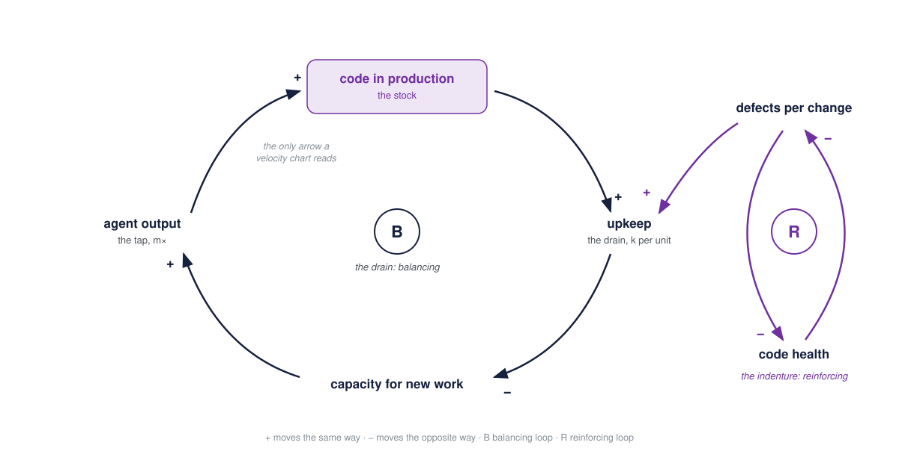
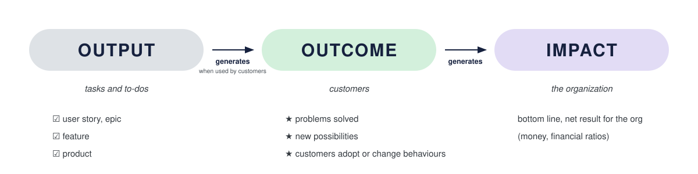
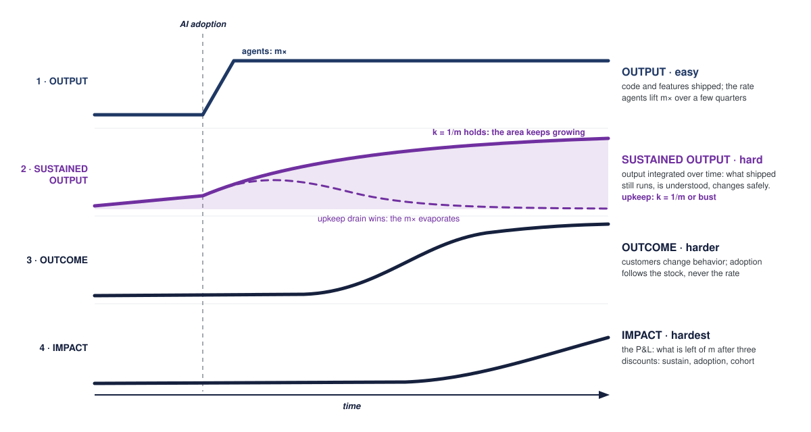
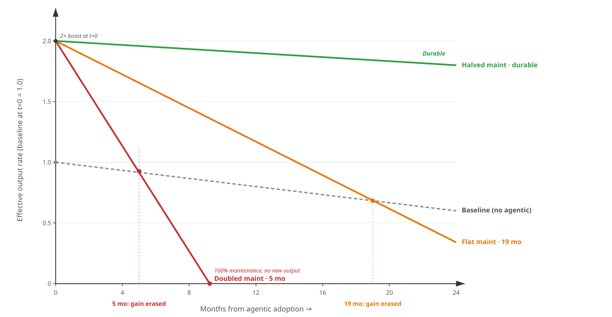
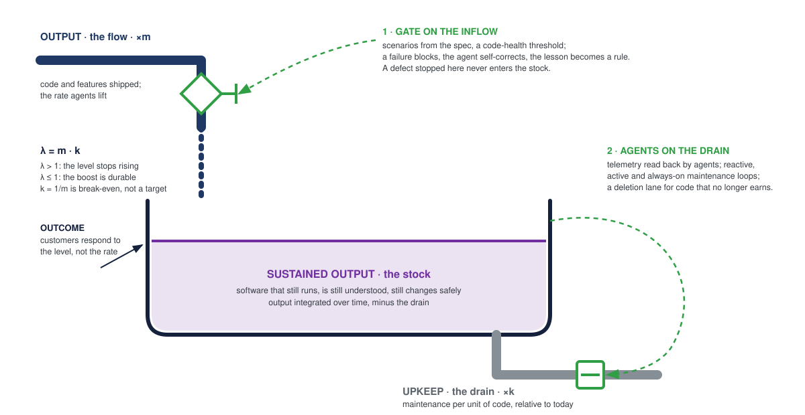

# Sustained Output Is the Job

*Two stories fill my feed. They are the same failure, and it has a name.*

The first story: we rolled out coding agents, throughput went up, and nothing happened to the business. The second, worse one: throughput went up and quality went down. Incidents climbed, review queues filled, and the few people who understood the system spent their days reading code they had not written.

**TL;DR.** The two stories are one system. Output is a flow. The business responds to a stock. Between them sits a rung the output → outcome → impact ladder never had: sustained output, the software that still runs, is still understood and still changes safely. AI opened the tap. The drain, upkeep per unit of code, is the variable almost nobody instruments and the one an engineering leader controls. Managing it is what an organization that heals and improves itself looks like: verification ahead of the code, a code-health gate that blocks and self-corrects, agents on the maintenance queue. Output is the agents' rung now. Sustained output is yours.

## The lens

Systems thinking is on every job spec for agentic product engineering now, and for once the fashion is right. Francisco Trindade and Rachel Laycock's *Leading Effective Software Teams* carries it in the subtitle, and it is next up in the book club I run with my engineering managers \[2\]. Both feed stories are the failure systems thinking names: an organization measured a rate and expected a level to move.

Donella Meadows separates three things everyday language blurs \[1\]. A *flow* is a rate. A *stock* is what accumulates when the flow runs and the drain does not empty it. A *response to the stock* is behavior that keys off the level, not off the rate. Her bathtub version: you get wet from the water level, not from how far the tap is open.

Systems thinkers carry two drawings for this. A causal loop diagram shows which loops are running and whether each one reinforces or balances. A stock-and-flow diagram shows where the level sits, what fills it and what drains it.

*The throughput trap as loops. Agents push on the first arrow, and a velocity chart reads only that arrow. The balancing loop through upkeep takes the gain back. The reinforcing loop through code health decides how fast.*

Meadows also ranked the places to intervene in a system \[1\]. A parameter, such as the multiple m, sits at the bottom of her list. The strength of the balancing loops and the structure of the information flows sit several rungs above it. Keep that ranking in mind: every vendor sells you m, and almost nothing on offer touches a loop.

## The ladder and the rung it never had

For years I have used Christophe Achouiantz's output, outcome, impact visual \[3\]. Output is what you ship. Output generates outcome when customers use it. Outcome generates impact, the bottom line. Three rungs, drawn before agents.

*Achouiantz's ladder. Output is tasks and to-dos, outcome is what changes for customers, impact is the net result for the organization.*

Here it is with the missing rung drawn in.

*Each rung starts later and climbs slower than the one above. Agents move the first rung and tax the second. They do not touch the last two.*

**Output is the flow.** Code and features shipped this week. Agents lift that rate, call the multiple m.

**Sustained output is the stock.** The body of software that still runs, is still understood, and still changes safely. Output integrated over time, minus the upkeep drain. Titus Winters' definition is the compact version: engineering is programming integrated over time \[4\]. A stock is what a customer can rely on. It is not what a velocity chart measures.

**Outcome is the response to the stock.** Customers adopt a product that reliably exists. Nobody adopts a shipping velocity. So outcome follows the level, with a lag, and ignores the climb in the rate entirely.

Adam Bender said the same thing in one sentence: there is a big difference between generating code 10× faster and engineering 10× faster \[5\].

## The drain

James Shore put a condition on the stock \[6\]. Every month of code written creates a maintenance obligation that lasts as long as the code exists. An m× boost in output is durable only if upkeep per unit of code falls to 1/m of what it was. Otherwise the drain grows with the pile and eats the gain.

Write the maintenance factor as k, relative to today's code, and only one number matters: λ = m·k, the rate at which past output consumes future capacity.

*Shore's math as curves. The 2× boost lands at month zero. With upkeep per unit of code unchanged the drain takes the gain back in 19 months; doubled, in 5, and the line keeps falling below baseline. Only the halved-maintenance trajectory stays up.*

| Scenario | m | k | λ | What happens |
| --- | --- | --- | --- | --- |
| Today, no agents | 1× | 1.0 | 1.0 | the baseline slow sink |
| Agents, same-quality code | 2× | 1.0 | 2.0 | boost erased in about 19 months |
| Agents, code reviewed by vibes | 2× | 2.0 | 4.0 | boost erased in about 5 months, then a permanent penalty |
| Durable 2× | 2× | 0.5 | 1.0 | all of the benefit, none of the debt |

*Shore's arithmetic on a 2× output boost. k = 1/m is not a target. It is the break-even condition.*

The two feed stories are the two failing rows.

"Throughput went up and nothing happened" is the λ = 2 row. Upkeep per line stayed flat, the pile doubled, and within a year and a half the team spends the gain maintaining it. Outcome never moved because outcome follows the level, and the level never rose.

That is one diagnosis, and I have to be honest that it is not the only one. The rung after sustained output asks a second question: was the extra output worth building? Ron Kohavi's controlled-experiment data from Microsoft and Bing puts the share of shipped ideas that move their target metric somewhere between a tenth and a third \[14\]. An m× tap does not change that ratio. It ships m× more from the same backlog, deeper into the misses, and the marginal feature has a lower hit rate than the ones that were already queued. So a flat business behind a rising velocity chart has two possible causes: a drain that ate the stock, or a backlog whose next item was never going to move a customer. The first is engineering's to fix. The second is product's, and no amount of code health touches it.

"Throughput went up and quality went down" is the λ = 4 row. Shore's word for what follows is *permanent indenture*: switch the agents off later and the boost leaves, but the maintenance debt stays.

The row is not hypothetical. Faros analysed two years of telemetry from 22,000 developers on 4,000 teams and found that where AI adoption crossed half the team, incidents per pull request more than tripled, code churn rose more than eightfold, and deployments per week fell \[7\]. Their one-line diagnosis: throughput measures what was shipped, not what survived. DORA's 2024 report had already found a 25% increase in AI adoption associated with a 7.2% drop in delivery stability \[8\]. And Markus Borg and Adam Tornhill measured the mechanism at the level of the file: agents refactoring code below a Code Health score of 9.4 inject roughly 30% more defects than agents working in healthy code \[9\]. The pile does not only grow. It grows in the material that makes the next change more expensive.

"The agent wrote 60% of our code" is a claim about the tap. The question the drain asks is what happened to k, and almost nobody instruments it.

The third question sits on the top rung and nobody inside the company owns it: did everyone else do the same? When every firm in your cohort rents the same models and harnesses, an m× gain is competed away within a season; Leigh Van Valen's Red Queen, borrowed from Carroll, is the mechanism: all the running you can do, to stay in the same place \[10\]. "We ship three times faster than last year" is table stakes.

Put the three together and the impact rung reads as arithmetic rather than aspiration. Impact is m multiplied by three ratios, each at most 1: did the stock hold, did anyone adopt it, did the cohort match it. A single coefficient on m hides this, because the three move with m in different directions and belong to different people. The product form keeps them apart, and it makes one thing plain to an engineering reader: a zero anywhere zeroes the product, and the sustain ratio is the one that goes to zero first.

## Two levers on the drain

*The same system as a stock-and-flow diagram, which is the engineering leader's view of it. The tap is the agents' job. The level is what customers respond to. The drain is yours, and there are exactly two places to act on it.*

Shore names two levers, and most readers hear only the first: more maintainable code, and AI that makes maintenance itself more productive. Martin Spier, who runs performance engineering for ChatGPT, described what both look like at the far end of the velocity curve \[11\].

His starting observation is the one that changes the job. At agentic velocity, no human comprehends every change any more. Engineers run seven to ten agent threads in parallel. Review by comprehension does not scale to that, and adding reviewers does not help; Faros found the same thing: the code arriving for review was not ready. So verification has to move to before the code exists, into contracts, tests and benchmarks that judge each change mechanically. That is the first lever, drawn as a gate on the inflow. A defect caught at the gate never enters the stock, and never becomes maintenance.

The second lever is on the drain itself. Spier's team did not hire more performance engineers. They made the maintenance workflow agentic: a reactive loop that profiles a regression and proposes a benchmarked fix, an active loop of specialist agents continuously hunting hot paths and allocations, and an always-on loop where senior-engineer skills are translated into standing agent skills. The preconditions are ops data and safety rails: clear telemetry, feedback in minutes, safe rollout.

Put the two levers together and the arithmetic changes. If agents only write new code, m applies to the numerator of λ and never to the denominator. Agents have to work the maintenance queue too: dependency upgrades, triage against the spec, log-driven diagnosis, and deletion candidates. Deletion deserves the last word there. There is a hard ceiling on how much living code a team can carry, and the only way to reclaim capacity under it is to remove code that no longer earns. A decommissioning lane is a first-class factory activity, not housekeeping.

## A system that heals and improves

There is a ladder for this, and it measures the right thing. Andy Anderson's AI Codebase Maturity Model grades the codebase, not the agent \[12\]. Its levels are defined by feedback-loop topology: open loop, one-way instruction, measured, closed loop with automated response, system proposes and humans approve, and a fleet acting under policy. In the model's own words, the intelligence of an AI-driven development system resides not in the model itself but in the infrastructure of instructions, tests, metrics and feedback loops that surround it. That is Meadows' leverage ranking applied to a codebase: the levels climb by adding and closing loops, never by turning up a parameter.

Read that against the bathtub. At level three you can read the drain: a metric exists and a human interprets it. At level four the drain manages itself: a threshold fires an automated response with no human in the path. The step from three to four is the step from a quality dashboard to a system that heals. It is also the step where a better frontier model does you no good. Nobody moves you up that ladder except you, one closed loop at a time.

Lisanne Bainbridge described the human side in 1983: the more a system is automated, the more the remaining human work is supervision and exception handling, and that demands more skill, not less \[13\]. Automation raises and narrows the bar for the people left.

## What we are building at ChronosHub

The principles above are the design of our software factory, so here are the tactics, from first principles.

**The gate on the inflow.** The Event Model is the spec, and every slice, an update or view of the system, carries its own verification (in the form of BDD scenarios). Those scenarios become the tests each change must pass before it exists in the codebase, which is the left shift Spier describes. Inside the agent's harness sits a code-health threshold, the Borg and Tornhill bar, applied to what the agent writes. A failure blocks. The agent corrects itself. The reason it failed is written down as a rule the harness holds every later run to, so the gate gets stricter with use instead of with prompt archaeology. Where a design deliberately trips a rule, the exemption is documented, scoped to the file, and shown in every report. The global bar is never lowered to make a dashboard green.

**Agents on the drain.** Telemetry is emitted as a convention, so agents can read the running system back, and published service levels give them something to hold it to. Maintenance agents run on that data, reactive and standing. The maintenance queue is agent work: upgrades, triage against the spec, candidates for deletion. And the same scenarios that specified the build run as monitors of the running system, so production is checked continuously against the spec that built it.

## What would change my mind

Three things, in descending order of how much they bother me.

Faros' finding that troubles me most is not the incident rate. It is that organizations with strong pre-AI engineering practices saw the same degradation as those without \[7\]. Their maturity was process maturity, measured on systems built for human-paced change, and my claim is that agent-readiness maturity is a different thing. That is a hypothesis under test, not a result. Nobody in their dataset was doing what I describe, which cuts both ways.

The maturity model's own evidence is a throughput result on infrastructure tooling. I will not cite it, because a throughput gain is a tap reading, and this whole essay is about the drain.

And our own factory has not run long enough on production systems to publish a k. I know what we are instrumenting. I do not yet know what it says.

## Three numbers for the engineering leader's dashboard

In dependency order.

1. Upkeep per unit of software in production, trending. This is k. If it is not falling, nothing below it will move.
2. Share of engineering capacity on value work versus maintenance, trending. Shore's model puts the crossing point, where maintenance consumes more than half, within two to three years on the failing rows. Faros' leading indicators are usable proxies today: incidents per pull request, code churn, and work restarted.
3. Per repository: code health against the agent gate, and an inventory of which feedback loops close without a human. That inventory is the maturity level, stated as loops rather than as a badge.

Almost nobody can put those three on a slide today, which is the useful part.

## The job

The first rung belongs to the agents now, and it will be competed away as fast as your cohort renews the same subscriptions. The rung under it, the one the ladder never drew, is where the engineering leader's work went. Instrument the drain, gate the inflow, put agents on the outflow, and keep enough people who understand the whole to catch what the loops miss.

Two rungs further up, what is left of m after the three discounts decides whether the company is an AI company or a company using AI. I made that argument for a CEO and board audience in [AI-Native Is a Financial Shape, Not a Tooling Choice](ai-native-is-a-financial-shape.md). This is the rung underneath it, and it is ours.

---

\[1\] Donella H. Meadows, *Thinking in Systems: A Primer*, Chelsea Green, 2008.
\[2\] Francisco Trindade and Rachel Laycock, [*Leading Effective Software Teams: Systems Thinking for Engineering Managers*](https://franciscotrindade.me/leading-effective-software-teams-book/), 2026.
\[3\] Christophe Achouiantz, [Output vs Outcome vs Impact](https://blog.crisp.se/2019/10/16/christopheachouiantz/output-vs-outcome-vs-impact), Crisp, 2019, building on Jeff Patton's work.
\[4\] Titus Winters, Tom Manshreck, Hyrum Wright, *Software Engineering at Google*, O'Reilly, 2020.
\[5\] Adam Bender, [Software Engineering at the Tipping Point](https://www.youtube.com/watch?v=2n41YjR5QfU), Google lecture, 2026.
\[6\] James Shore, [You Need AI That Reduces Your Maintenance Costs](https://www.jamesshore.com/v2/blog/2026/you-need-ai-that-reduces-your-maintenance-costs), May 2026.
\[7\] Faros AI, *AI Engineering Report 2026: The Acceleration Whiplash*, March 2026. Telemetry from 22,000 developers and 4,000+ teams; incidents per PR +242.7%, code churn +861%, deployments per week −11%. Lead time and deployment figures are measured on a tenth of the dataset and the report itself says to read them directionally.
\[8\] DORA, *Accelerate State of DevOps Report 2024*, Google Cloud, 2024.
\[9\] Markus Borg and Adam Tornhill, [Code for Machines, Not Just Humans: Quantifying AI-Friendliness with Code Health Metrics](https://arxiv.org/abs/2601.02200), arXiv:2601.02200, 2025.
\[10\] Leigh Van Valen, "A New Evolutionary Law", *Evolutionary Theory* 1, 1973.
\[11\] Martin Spier, [Keeping ChatGPT Fast as AI Development Accelerates](https://www.infoq.com/presentations/openai-performance-engineering-agentic-coding/), QCon AI 2026, via InfoQ, August 2026.
\[12\] Andy Anderson, *The AI Codebase Maturity Model: From Assisted Coding to Fully Autonomous Systems*, arXiv:2604.09388v2, 2026.
\[13\] Lisanne Bainbridge, "Ironies of Automation", *Automatica* 19(6), 1983.
\[14\] Ron Kohavi, Diane Tang, Ya Xu, *Trustworthy Online Controlled Experiments: A Practical Guide to A/B Testing*, Cambridge University Press, 2020. The book reports that at Microsoft roughly one third of ideas improved their target metric, and at Bing and Google the success rate is closer to 10 to 20%.
