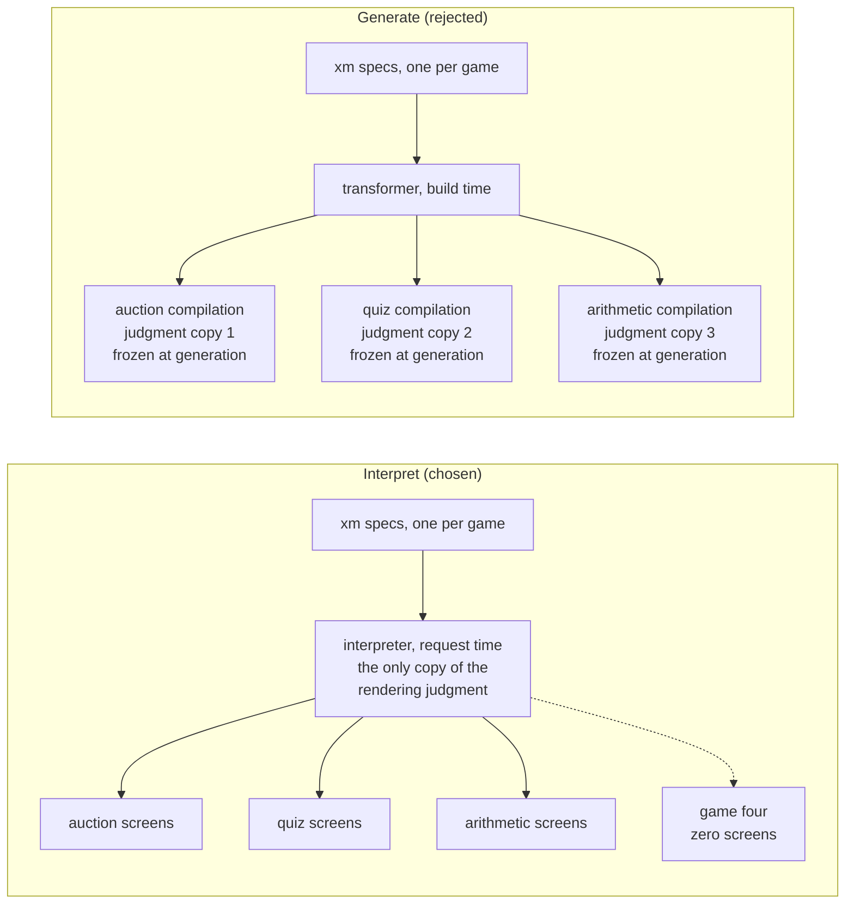
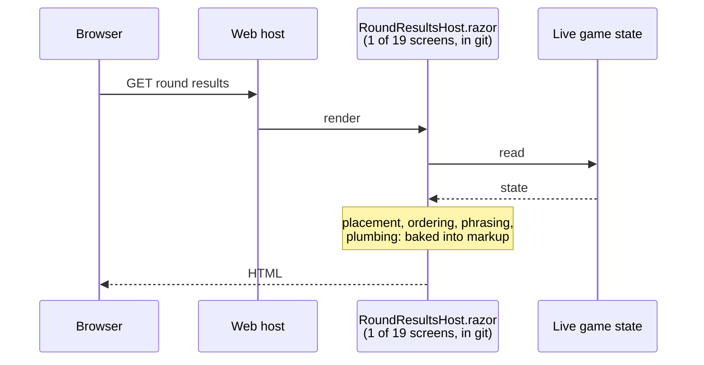
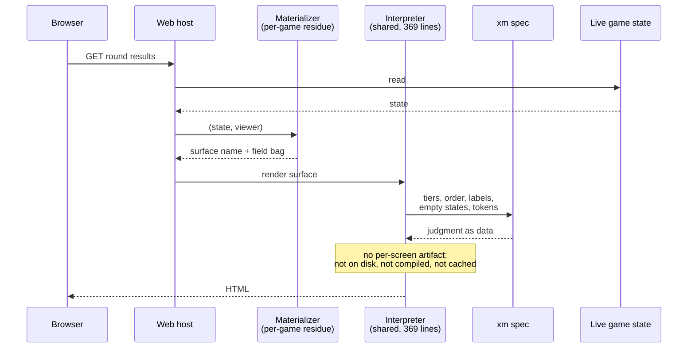
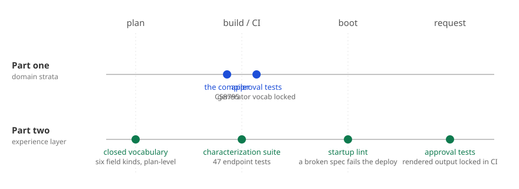
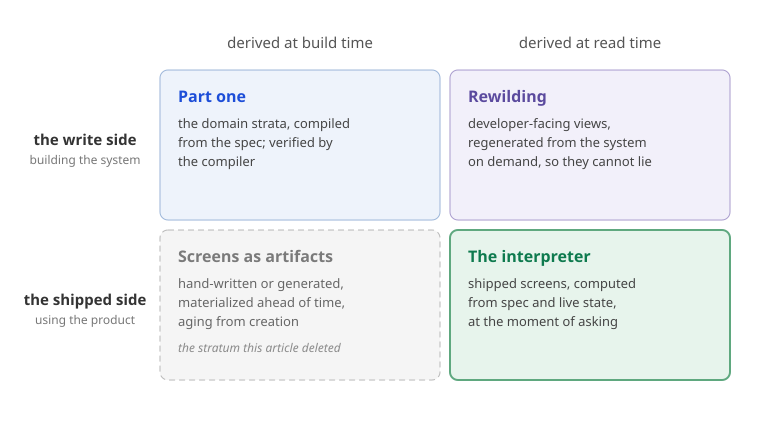
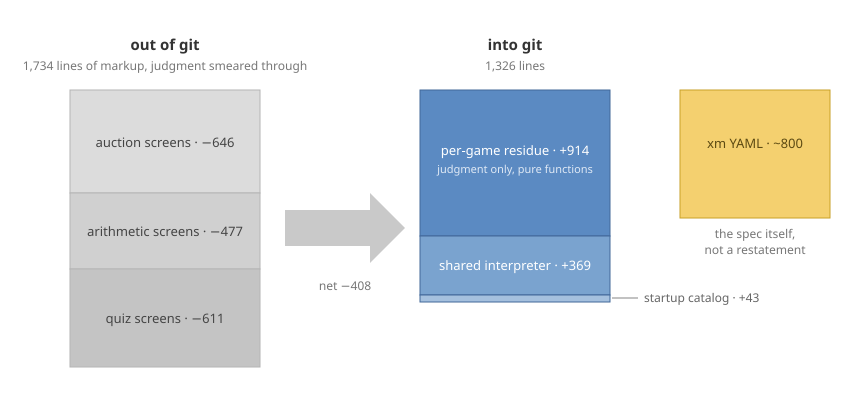

# The Screens Left the Repo, and Nothing Replaced Them

> Part one deleted code the compiler regenerates on every build. This time 1,734 lines left git and nothing regenerates them, ever. The screens are evaluated from the spec, per request.

## Previously, on the repo boundary

["The Spec Is the Product" Is a Slogan Until the Code Leaves Your Repo](the-spec-is-the-product.md) drew one rule and followed it until it hurt: never hand-maintain what a function of the spec can emit. In a small production workbench — three event-sourced multiplayer games behind one web front, 100% of the code agent-written — that rule ate three strata of C#. The domain vocabulary (every command, event, and business error), the `Given–When–Then` scenarios as xUnit facts, and the dispatch switches of the deciders all became in-compilation outputs of a Roslyn source generator: 2,754 lines out of git, 708 lines of transformer infrastructure in, 115 tests with no file anywhere on disk, drift unrepresentable because the derived representation has no independent existence.

The mechanism had a signature: a deterministic *transformer*, running at *build time*, verified by the *compiler*. A fake event added to the spec fails the next build with [**CS8795**: _Partial member must have an implementation part because it has accessibility modifiers._](https://learn.microsoft.com/en-us/dotnet/csharp/language-reference/compiler-messages/partial-declarations#partial-methods) and the name of the method a human now owes; that seam was the whole argument.

The rule does not stop walking because the next stratum looks different. The next stratum was the UI — nineteen hand-written Razor screens across the three games — and under it, the mechanism changed. This article is about what it changed into, because the answer was not "generate the screens too."

## The ring outside the blueprint

[Software Civil Engineering](software-civil-engineering.md) argued that a specification worth the name has four layers, and drew them as rings:


*The four layers. Part one industrialized the inner ring. This article is about the second.*

Part one lived entirely in the inner ring. An event model states what the system *does*: commands, events, views, scenarios. It deliberately says nothing about what anyone *sees* — which fields matter most on which screen, for whom, in what order, under what name, in what typeface. That is the Experience Model's ring: how humans inhabit the system. Civil engineering splits these professions for a reason; the structural engineer certifies the building will not fall down, the architect ensures people can inhabit it.

The question was whether that ring can be a formal spec at all, and a [prior research pass through thirty years of model-based UI](machine-readable-ux-specs-research.md) returned a precise answer: yes, exactly as far as the *abstract* UI — composition, data binding, salience, naming — all the way and deterministically, and not one step further. Every machine-readable UI system that ever shipped at industrial scale (server-driven UI, Adaptive Cards, JSON Forms) obeys the same constraint: it determines composition over a closed, hand-built component vocabulary, and it never determines what a component looks like. The doctrine that fell out is one sentence: **the experience model records judgment as data, never as geometry.** Memberships, orderings, tiers, names, and design tokens are in; coordinates, containers, and breakpoints are out.

So the workbench got a second spec dialect, [xmlang](https://github.com/MartinRL/xmlang), an experience-model sibling to the event-model dialect with a strictly one-way dependency: every xm element references event-model elements — surfaces compose views and commands, journeys traverse slices — and the event model never references back. The layering paid for itself before a single screen was rendered: the first thing writing an xm surfaced was that surface judgment had been quietly colonizing the event model's *naming layer* — views named `Screen / Auction lobby` instead of by the data they carry. With somewhere legitimate for that judgment to live, the views in all three event models were renamed to bare data nouns (`Roster`, `Round scores`, `Scoreboard`), and the inner ring got purer by acquiring a neighbor.

## Experience judgment, as data

Here is what one game's worth of that judgment looks like. *Blindbudet is a sealed-bid auction: hidden bids, overbids disqualified, highest valid bid wins. Its entire experience model is 255 lines of YAML; this is the round-results pair:

```yaml
RoundResultsHost:
  during: { Game: [started] }
  for: [Host]
  compose:
    - v: Round scores
      self: playerProfits.playerId
      fields:
        primary: [trueWorth, winnerIds, playerProfits]
        secondary: [pricePaid, lotIndex]
        on-demand: [gameId]
    - c: AskNextLot
      prominence: primary
      confirm: true
      then: Bidding
    - c: EndAuction
      prominence: primary
      confirm: true
      then: FinalScoreboard

RoundResultsPlayer:
  during: { Game: [started] }
  for: [Player]
  compose:
    - v: Round scores
      self: playerProfits.playerId
      fields:
        primary: [trueWorth, winnerIds, playerProfits]
        secondary: [pricePaid, lotIndex]
        on-demand: [gameId]
```

The `during` key uses a map form `{ Game: [started] }` to name which decision model the phase values come from — xmlang supports multiple concurrent decision models, so it requires you to specify which one's phases you're referencing.

xmlang provides two forms of interaction judgment for commands: `confirm:` marks decisions that carry consequences and should prompt friction (asking the user to confirm before proceeding), and `then:` specifies the surface the player returns to after the command completes. These are judgments about the experience — what the command means to the player and where they land afterward — and they belong co-located with the command in the spec, not buried in the interpreter. The placement rule follows the same doctrine as the example above: every experience decision lives here, as data, alongside the structural decisions that already did.

Read what is stated: this surface exists during the `started` phase, for the host persona; it composes the `Round scores` view (a name from the event model — a dangling reference here is a build error); the true worth and the winners are primary, the price paid is secondary, the game id is on-demand; the viewer recognizes themself by `playerId`; the host gets the two pacing commands and the player, composing the *same view* a second time, gets none. Read what is absent: no pixels, no columns, no breakpoints, no component names. The spec also carries every string a human reads, down to the empty states —

```yaml
"Round scores":
  winnerIds:
    $empty: No winners — all overbid.
```

— and the sanctioned visual vocabulary as DTCG design tokens transcribed from the live stylesheet. Who sees what, when, in what order, under what name, in which palette: judgment as data. How it is laid out: someone else's job. Whose, is the interesting part.

> [!todo] Visual: same spec, two screens
> Screenshot pair (preferred) or abstract wireframe pair of the host and player round-results screens as the interpreter materializes them from the YAML above: the same `Round scores` view composed twice, host with the two pacing commands, player with none; primary prominent, secondary quieter, on-demand behind disclosure.
> Caption must say this is *one possible materialization*; the geometry belongs to the interpreter, not the spec. Real screenshots keep the "no geometry in the spec" doctrine intact; a wireframe risks reading as layout the spec supposedly contains.

## Generate, or interpret

Part one's ladder ranked every approach by two properties: who transforms, and what verifies. The obvious continuation was more of the same — write a transformer that emits `.razor` into the compilation, let the compiler verify it, delete the screens. That was the plan right up until it wasn't, because presentation has a property the domain strata don't: **one transformer's judgment serves every game.** The rendering decisions — how a salience tier becomes disclosure, how a roster becomes a card, where commands sit relative to content — are identical across the auction game, the quiz game, and the arithmetic game, and should be identical across game four. A transformer would stamp three frozen copies of that judgment into three compilations, each aging from the moment of generation. An interpreter keeps one copy, executing at request time: improve the transformer once, and every screen of every game improves at the next deploy.



*The fork. A transformer stamps the rendering judgment into each compilation, where it ages from the moment of generation; the interpreter holds one living copy that every screen of every game runs through per request. Improve it once and everything improves at the next deploy.*

So the screens are not generated. They are *interpreted*. A shared runtime — 369 lines of Razor components with a hard rule that no game name may appear in them — walks the xm surface and renders it: primary fields prominent, secondary fields quieter, on-demand fields behind a `<details>`, commands after content, labels and empty states and tokens straight from the spec. There is no per-screen artifact anywhere: not on disk, not in the compilation, not cached between requests. Part one told three acts of .NET code generation — the comment fence, the Designer file, the in-compilation source generator — each act moving the generated artifact somewhere harder to edit. Act three put it where no one could edit it. Act four is shorter: **there is no artifact.** The repo-boundary argument reaches its fixed point, because you cannot commit what is never materialized. If the layering smells like MDA, em to xm to screen as CIM to PIM to PSM, the resemblance is real; the difference is that MDA persisted every intermediate model and died in the rot between them. Interpretation is the viewpoint hierarchy with the platform-specific model never materialized: nothing exists between spec and screen, so nothing between them can drift.

The fair objection is that MDA's intermediates rotted because they were hand-touched, and that a generated, automatically validated intermediate would not. Grant it, and the distinction sharpens rather than dissolves. The intermediate model exists here too: the materializer's output, a surface name and a field bag, is the platform-independent model of one screen. It is computed for one request, held in memory, and gone. That is the line between an intermediate and an artifact. A persisted intermediate, however well validated, can only ever *detect* drift after it has happened; an intermediate that is never materialized makes drift unrepresentable, because there is nothing to have drifted. Traceability, the one thing persistence is supposed to buy, is served better by computing the intermediate on demand than by storing it, for the same reason Rewilding's views are. And one rule follows for the models themselves: no inferential transformation *between* them. An LLM between two models is the stochastic transformer of part one's second rung, relocated one level up. The LLM belongs above the top model, writing specs and residue against oracles, never between models.





*The same request, before and after the cut-over. The lifeline that vanished is the per-screen artifact; what stands in its place is not another artifact but a computation over the spec, the residue, and live state, performed at the moment of asking.*

Before the analogy leaves the stack, notice that the stack already ships both verbs for one transformation and lets a flag choose. A Minimal API route, `app.MapPost("/bids", handler)`, is a table interpreted at boot: `RequestDelegateFactory` reads the handler's signature and builds the request delegate in memory when the app starts. Turn on Native AOT and the Request Delegate Generator, a Roslyn source generator, emits the same delegate at build time instead. Nobody rewrote a handler; the framework picked the verb by a deployment property, not by nerve. Wolverine's `TypeLoadMode` is the same choice as an enum: `Dynamic` interprets handler signatures at first use, `Static` loads adapters pre-generated by `codegen write`, `Auto` hedges. System.Text.Json offers it one layer down, a reflection resolver at runtime or a `JsonSerializerContext` at build.

| Transformation | Interpret | Generate | Who picks |
|---|---|---|---|
| Minimal API route | `RequestDelegateFactory`, at boot | Request Delegate Generator, at build | `PublishAot` |
| Wolverine handler adapter | `TypeLoadMode.Dynamic`, at first use | `TypeLoadMode.Static`, after `codegen write` | one option |
| System.Text.Json contract | reflection resolver, at runtime | `JsonSerializerContext`, at build | one attribute |
| xm surface | the interpreter, per request | rejected: one frozen copy per game | the argument above |

*The same fork, four times. Three of the rows are in the reader's stack already; the framework chooses the verb by a deployment property, and neither verb is the exotic one.*

This is not an exotic move; it is the oldest one in the stack. Nobody generates per-page rendering code from HTML — the browser is an interpreter of a declarative spec, and improving the browser improves every page ever written. The xm interpreter is that, one level up, for one product family.

Honesty about the second property, though, because it genuinely changed: **what verifies is no longer the compiler.** No [CS8795](https://learn.microsoft.com/en-us/dotnet/csharp/language-reference/compiler-messages/partial-declarations#partial-methods) fires when a surface references a view that doesn't exist. Four oracles stand where the compiler stood:

1. **Lint at startup.** The web host parses and lints each spec pair as it boots and throws on any error — a dangling xm→em reference, a mislabeled field — naming the rule and the element. The deploy fails; a broken screen never renders. The seam still screams with a name; it just screams at boot time instead of build time.
2. **Characterization tests.** Forty-seven endpoint tests pin semantic markers — the overbid strike-through, the shared-win line, the descending final table — against the rendered output. They were written against the hand-written screens *first*, then the interpreter was required to pass them unchanged: the old UI's behavior became the oracle for its own replacement, and only when parity was green did the screens leave git.
3. **Approval tests.** The interpreter's rendered output is locked in approval tests, stored in git, identical on every re-run. The moment the interpreter drifts — a field reorders, a label changes format, a token color shifts — the test fails in CI. This is the same determinism guarantee part one achieved on the backend: what the spec authorizes is frozen, and any divergence is caught before deploy. The same contract as the source generator's vocabulary tests, moved to the shipped UI.
4. **A closed vocabulary.** The interpreter renders exactly six field kinds — text, roster, table, magnitude bars, QR, steps — as a sealed union. A new kind is a plan-level decision, never a per-feature accretion. Closure is what keeps the interpreter reviewable the way part one's transformer was reviewable: once.



*Where the seam screams. Part one's oracles (compiler and source generator approval tests) fire at build time and their failures cannot leave the build machine; part two's four oracles fire at plan, CI, boot, and request — the interpreter's rendered output is locked and verified at CI time, just as the generator's vocabulary is locked and verified at build time.*

Weaker than a compile error? At the margin, yes, and it should be said plainly: a transformer's failures cannot leave the build machine, an interpreter's failures are runtime failures held back by a boot-time gate. That is the price of one living copy of the design judgment, and I think the trade is right for exactly the reason the guarantee is weaker — the judgment keeps executing, so it can keep improving. It is also the trade Minimal API makes in its interpreted mode: a handler parameter that cannot be bound fails when the app starts, not when it builds, and nobody calls that reckless.

Name the shift precisely: part one's contract was equality, the artifact is exactly `f(spec, transformer)`, byte-identical on every regeneration. The second ring deliberately weakens that to a conformance contract: the rendered output is never pinned, it need only stay within what the spec authorizes, as judged by the four oracles. Equality belongs where the transformer contains no LLM and the output has one correct form; conformance belongs where the transformer is meant to keep improving. One contract per ring is the discipline, and the weakening is the purchase price of a living transformer.

There is a symmetry here worth naming. Part one cited Gîrba and Wardley's [Rewilding Software Engineering](https://medium.com/feenk/rewilding-software-engineering-900ca95ebc8c), whose cure for stale developer-facing views is derivation at *read time*: regenerate every view from the system on demand, so it cannot lie. Part one was the build-time answer on the write side — derive the system from the spec. The interpreter closes the square: derivation at read time, on the *shipped* side. Every screen a player sees is a contextual view over live game state and the spec, computed at the moment of asking. It cannot be stale, cannot drift from the spec, cannot disagree with the event model — for the same reason in every case: it has no independent existence to disagree *from*.



*The square, closed. Part one derives the system from the spec at build time; Rewilding derives developer views from the system at read time; the interpreter derives shipped screens at read time. The fourth corner, presentation materialized ahead of time, is the stratum this article deleted; the three occupied corners cannot go stale for the same reason: no independent existence.*

## The ledger, honestly

Three cut-over commits, one per game, each landing only after the parity suite was green on the interpreter path: −646 lines (the auction game: eight screens plus their view-models), −477 (the arithmetic game: six screens), −611 (the quiz game: five screens plus its form and screen layer). Nineteen screens, 1,734 lines of presentation code out of git.

What came in: the 369-line shared interpreter, a 43-line startup catalog that loads and lints the specs, and — this is the number that keeps the ledger honest — 914 lines of per-game *residue*, one `Surfaces` file per game. Net, the repository shrank by only about 400 lines, and if that were the claim it would be a poor trade for a new dialect. The claim is about what kind of line survived. The deleted stratum was markup with judgment smeared through it: placement, ordering, phrasing, and plumbing, restated per screen, reviewable only by rendering. The residue is judgment *only*, as pure functions — `(state, viewer) → surface name`, `(state, labels) → field bag` — unit-testable without a browser, and the 800 lines of YAML became the readable surface where the ordering and phrasing actually live. The same accounting lesson as part one, which predicted 410 lines and got 150: the win was never the count. It was what each remaining line is *for*.



*The ledger, to scale. Grey is deleted restatement; blue is surviving judgment, of which the interpreter is constant in the number of games; amber is the spec itself, not a restatement of anything. Net −408 lines, and the count was never the claim.*

And the interpreter is constant in the number of games. Game four ships its in-game UI as roughly 250 lines of xm YAML and a materializer file — zero screens.

## The residue report

Part one made a promise: the ghost of MDA is patient, and if the typed seams start filling with hand-maintained metadata, the correct move is to write *that* article. This is the inspection visit, one stratum later, and the seams contain exactly what they were designed for — but "what they were designed for" turned out to be worth designing. Three contracts hold the boundary between spec and residue:

**The presence contract.** The xm owns field order and tier; the materializer owns *presence*. When the bid screen omits the lot's `description` and `unit` from the field bag because they are hoisted into the heading and the keypad label, that is a deliberate, unit-tested judgment — never a rendering fallback:

```csharp
// description/unit are hoisted into the heading + keypad; totalLots is composed into
// the lotIndex pill copy — the presence contract's deliberate omissions.
var fields = new Dictionary<string, Field>
{
    ["lotIndex"] = new TextField($"Bid round {i + 1} / {c.State.Lots.Count} · BlindBid", "pill"),
};
```

**The defaults contract.** Commands that compose no view — the create-auction and join forms — are not surfaces at all; the transformer serves its own default form for them, built from the spec's labels. The strict compose rule *predicted* which two forms in the shipped UI would be bare, which is the pleasant experience of a spec telling you something about your product you hadn't stated. xmlang makes these derivation rules explicit: entry surfaces depend on which roles have commands at which phases; command destinations depend on explicit `then:` judgment; enablement depends on `for:` scopes. Where traditional UIs hide these decisions in interpreter code, xmlang declares them in the spec where they belong.

**Derived behavior, not vocabulary.** The polling rule — which screens auto-refresh — is not in the spec, because it is derivable: poll exactly when the surface has no typed input and the game isn't over. The bid screen's materializer carries the whole rationale in one line: *"No PollPath: typed-input surface — polling would wipe a half-entered bid."* Where part one's rule was "never hand-maintain what a function of the spec can emit," the xm added its dual: never *specify* what a function of the spec can derive.

And where judgment is genuinely concrete — the numeric keypad for secret bids, the quiz game's two-stage direction-then-difference input with its live magnitude bars, the arithmetic game's counting-tape puzzle surface, the host's round-count slider — the design opts *out*. Whole surfaces, handed back to hand-written Razor, selected by name in one pure function. This is act three's answer to the last 20%, relocated: not a protected region rotting *inside* generated output, but a named boundary *beside* the derivation. Three games in, the opt-out list is short, stable, and every entry on it is a place where the product is genuinely, deliberately unlike a default — which is exactly what a residue should contain.


*The ownership map of the second ring. Judgment as data in the spec, judgment as pure functions in the residue, one living copy of rendering in the interpreter, and a short named list of genuinely concrete exceptions. The three contracts hold the leftmost boundary.*

## The dialect left the repo too

One more thing left git, and it was not code the spec derives — it was the machinery of the spec itself. xmlang's specification, parser, linter, and CLI began life inside the workbench, 557 lines of in-repo source. They now live in [their own repository](https://github.com/MartinRL/xmlang) under MIT, and the workbench consumes them as a NuGet package, the way it consumes the compiler. Part one's economics said: review the transformer once, then trust regeneration. Extraction is that sentence taken literally — the transformer became a versioned dependency with its own spec, its own test suite, and its own release discipline, reviewable by anyone, upgradeable like any package. A spec dialect that survives being extracted from its birthplace is some evidence it was a notation and not a local convention.

## Time to answer, time to question

Wardley has been insisting the industry fails to measure the two metrics that matter: ttA, time to answer, and ttQ, time to question. Reading code, he argues, has been bankrupt as a method of understanding systems of significant size for a decade — and having an LLM read it for you creates dependency, not understanding. The strata this project keeps deleting are precisely the strata about which questions used to require reading code.

"What does a player see mid-auction before they've bid, versus after?" used to be a tour of eight Razor files; it is now ten lines of YAML and a sixteen-line selector function. "Does any screen show data no event carries?" is not a question anymore; the boot-time lint answers it before the deploy completes. "What is the empty-state copy when everyone overbids?" is a one-line grep of the spec. ttA collapsed because the answers are small and declarative; ttQ collapsed with it, because a spec you can hold in your head is a spec you can cheaply interrogate — 800 lines of YAML currently carry the entire experience layer of three shipped games. Rewilding's premise is that systems stay too large to grasp and tooling must adapt to them; the premise here is that for the derivable strata, graspable-by-construction is achievable. Both are true, stratum by stratum, and the second keeps shrinking the territory where only the first can help.

## What is still in git

The metric from part one stands: lines in git that restate a spec, driven toward zero, ledger published each time. The candidates left are the usual suspects of pure structure — projection plumbing, serialization surfaces, an API contract if the product ever grows one. The materializers are *not* on the list, and the distinction is the whole discipline: they do not restate the spec, they state what the spec deliberately refuses to — presence, hoisting, phrasing composed from live state. Deleting restatement is the program; deleting judgment would just be losing the product.

The same reasoning answers a sharper version of the question: if the materializers are held by a conformance contract, why not regenerate them every build, by a model, and let them leave git as well? Because version control is for decisions, and the materializers are the decisions. The characterization suite pins exactly what it asserts, and everything it leaves open, every ordering it does not check and every phrasing it does not name, would vary from one regeneration to the next. Regenerating the residue would also put a stochastic transformer back on the build path, which is the arrangement the inner ring exists to end. So the strata part company at the repo boundary by their contract: what is held to equality leaves git, what is held to conformance stays, and the distinction is not about how the code was written but about what would change if it were written again. [The two-stage rocket](two-stage-sdd-rocket.md) makes the same argument for the domain residue, where the decisions are decider bodies instead of surface selectors.

## Where I might be wrong

**Vocabulary pressure is patient too.** Six field kinds survived three games, but every future game will arrive with a lobbyist for a seventh. The vocabulary only stays closed while additions are plan-level decisions; the day a field kind lands to unblock a feature branch, the interpreter has begun its career as a UI framework, and UI frameworks do not stay at 369 lines.

**The transformer is the design authority, and that is a choice.** This whole trade closes only if you accept the interpreter's rendering judgment as *the* design and reserve hand-written surfaces for genuine exceptions. A brand-first product whose designers own every screen would invert the ratio — all opt-out, no default — and the economics collapse. The claim is scoped: where a house style should be uniform, uniform-by-construction beats uniform-by-review.

**Concentration cuts both ways.** The interpreter is trusted the way a compiler is trusted, but it is not a compiler: it is 369 lines reviewed by one person (as of now), and a bug in it is a bug on every screen of every game simultaneously. The characterization suite guards the screens it characterized; game four's screens are guarded by the approval tests — any drift in rendering is caught in CI before deploy, and the same contract that pins the generator's output pins the interpreter's. The honest phrasing: I traded many small chances of drift for one small chance of systemic error, and I believe the arithmetic favors the trade without having proven it.

**The transformer is code, and so is the linter.** Three hundred and sixty-nine lines stay 369 only while two pressures are resisted. Over-generalisation: a special case for one game accreting into the shared interpreter, then another, until the interpreter is the mega-model the bounded specs were meant to prevent. Abstraction leakage: a platform-level concern, a breakpoint or a container rule, handled in the interpreter because it was the convenient place at the time. Both are what "vocabulary pressure" looks like from inside the code. And the xmlang parser and its linter are hand-written C#, a small number of rules over a small number of element kinds. At the scale of a product suite that becomes rules times element kinds, maintained by hand, and the point at which the rules should become declarative definitions that a generic engine evaluates may arrive before the count does. That is a risk statement, not a plan.

## Two verbs

Part one ended with three strata that exist only as functions of the specs, and a definition: "the spec is the product" means the spec is the only place those strata exist at all. The experience layer now has the same property with a different verb. The domain strata are *compiled* from the spec: derived once per build, verified by the compiler, materialized only inside a compilation, held to an equality contract. The screens are *interpreted* from the spec: derived per request, verified by a boot-time linter, characterization tests, and approval tests, materialized never, held to a conformance contract. Same rule, both times: the representation cannot drift, because it does not independently exist.

The inner ring compiles. The second ring interprets. Two rings remain, and the rule is still walking.

## References

The spec dialects live in [xmlang](https://github.com/MartinRL/xmlang):

- **xmlang** — Experience model specification language and interpreter. Spec, parser, linter, CLI under MIT. Deterministic with approval tests on the interpreter's rendered output.
- **emlang** — Event model specification language. Dialect and CLI; generators for each product own their own Roslyn source generator entry point.
